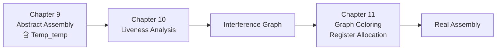
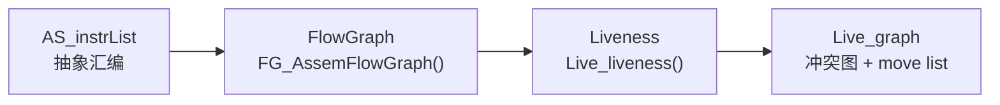

# Chapter 10: Liveness Analysis

chap9 把 IR 树翻译成了**抽象汇编**——其中每条指令的源/目的都用 `Temp_temp`（伪寄存器）表示。但真实机器的物理寄存器只有 8/16/32 个，远少于程序中可能产生的伪寄存器数。chap10–11 要做的就是**寄存器分配**：决定哪些 temp 共享一个物理寄存器，剩下放不下的就 spill 到内存。



判断两个 temp 能否共用一个寄存器的依据是它们的**生命期是否重叠**——这正是 liveness analysis 要回答的问题。

> **A variable is live** if it holds a value that **may be needed in the future**.

---

## 控制流图（Control-Flow Graph）

Liveness 是一种 **dataflow 问题**：每个变量的活跃信息沿着控制流的边"流动"。要做这种分析，先把指令序列建成一张控制流图：

- **node**：一条指令（也可以是 basic block）；
- **edge**：若指令 `m` 之后可能直接执行 `n`（fall-through 或 jump），就连一条 `m → n`；
- `succ[n]`：`n` 的所有后继；`pred[n]`：`n` 的所有前驱。

### 例子

教材的标准例子（Appel 10.1）：

```text
1:  a := 0
2:  b := a + 1
3:  c := c + b
4:  a := b * 2
5:  a < N           ; 条件跳转
6:  return c
```

控制流图的边：`1→2, 2→3, 3→4, 4→5, 5→2, 5→6`。其中 `5→2` 是循环回边。

<div align=center>

</div>

注意例 5 处既有 `5→2` 也有 `5→6`，所以 `succ[5] = {2, 6}`、`pred[2] = {1, 5}`。

---

## use 与 def

每条指令对每个变量做两件事之一：

| 概念 | 说明 |
|---|---|
| **def** | 该指令**写**这个变量（赋值左侧、运算结果寄存器） |
| **use** | 该指令**读**这个变量（赋值右侧、条件中、参数中） |

可以把 def/use 看成**节点 → 变量集合**的映射，也可以看成**变量 → 节点集合**的映射，两种视角等价。

上面例子里：

| n | use(n) | def(n) |
|---|---|---|
| 1 | ∅ | {a} |
| 2 | {a} | {b} |
| 3 | {b, c} | {c} |
| 4 | {b} | {a} |
| 5 | {a} | ∅ |
| 6 | {c} | ∅ |

---

## Liveness 的精确定义

> 变量 `v` 在边 `e` 上**live**，当且仅当存在一条从 `e` 出发到达某个 `use(v)` 的有向路径，且路径中**没有经过 def(v)**。

更具体地，对每个节点 `n`：

- **live-in**：`v` 在 `n` 的某条入边上 live，记作 `v ∈ in[n]`；
- **live-out**：`v` 在 `n` 的某条出边上 live，记作 `v ∈ out[n]`。

> **直观**：变量在未来"可能"被读到（且在被读到之前不会被覆盖）就是 live。

---

## Dataflow 方程

从 use/def 出发，可以推出三条规则：

| 规则 | 意义 |
|---|---|
| **R1**：`v ∈ in[m]` 且 `m ∈ succ[n]` ⇒ `v ∈ out[n]` | 后继的入活跃，向前流到当前节点的出活跃 |
| **R2**：`v ∈ use[n]` ⇒ `v ∈ in[n]` | 当前节点用到的变量，进入时必须 live |
| **R3**：`v ∈ out[n]` 且 `v ∉ def[n]` ⇒ `v ∈ in[n]` | 出口 live 且当前节点没有重新定义它，则入口仍 live |

合并三条规则得到 **Liveness Dataflow Equation**：

$$
\begin{aligned}
in[n]  &= use[n] \;\cup\; (out[n] \setminus def[n]) \\
out[n] &= \bigcup_{s \in succ[n]} in[s]
\end{aligned}
$$

<div align=center>

</div>

!!! note "为什么不直接 `out ⇒ in`？"
    R3 多了一个 `v ∉ def[n]` 的条件。原因：若当前节点 `n` 重新定义了 `v`，则进入 `n` 之前 `v` 的旧值已经不重要——出口处用到的是 `n` 自己写下的新值。所以 def 会"切断"liveness 的回流。

---

## 迭代求解

方程是**递归的**（`in` 依赖 `out`，`out` 依赖后继的 `in`），不是显式公式。教科书算法是不动点迭代：

```text
for each n:        in[n] ← ∅;  out[n] ← ∅
repeat
    for each n:
        in'[n]  ← in[n]
        out'[n] ← out[n]
        in[n]   ← use[n] ∪ (out[n] − def[n])
        out[n]  ← ⋃_{s ∈ succ[n]} in[s]
until ∀n: in'[n] = in[n] and out'[n] = out[n]
```

性质：

- **单调**：每轮迭代 `in[n]`、`out[n]` 只会增大，不会缩小；
- **有界**：每个集合都是程序中变量集合的子集，所以迭代必然终止；
- 终止时得到的解是**最小不动点**（least fixed point，下文再讲）。

### 计算顺序

朴素地按节点编号 `1 → 6` 走是**顺着控制流方向**的，但 liveness 是**反向流动**的（从 use 往回传），所以这个方向收敛慢。

教材给出的对照实验：

| 顺序 | 收敛迭代次数 |
|---|---|
| 正向（1 → 6，按 in/out） | 7 次 |
| 反向（6 → 1，按 out/in） | **3 次** |

**经验法则**：dataflow 的迭代顺序应当**顺着信息流的方向**走。
- forward 分析（reaching definitions、available expressions）：从入口往出口；
- backward 分析（liveness）：从出口往入口；从 `out` 算 `in`。

### 最终的 in/out 表

```text
n   use   def    in       out
6   c     ∅      {c}      ∅
5   a     ∅      {a,c}    {a,c}
4   b     a      {b,c}    {a,c}
3   b,c   c      {b,c}    {b,c}
2   a     b      {a,c}    {b,c}
1   ∅     a      {c}      {a,c}
```

可以看出：`a` 和 `b` **从未同时 live**（任何节点的 in/out 都不同时含 `a, b`），所以它们可以共用一个寄存器。这正是寄存器分配要利用的关键事实。

<div align=center>

</div>

---

## 复杂度

设程序有 `N` 个节点、`N` 个变量（用 N 同时表示二者，便于估计上界）：

- 每个集合最多含 `N` 个元素，单次集合并/差运算 `O(N)`；
- 内层 `for each n` 一轮做 `O(N)` 个节点 × `O(N)` 集合操作 = `O(N²)`；
- 外层 `repeat` 最多迭代多少轮？所有 `in[n] ∪ out[n]` 总大小上界 `2N²`，每轮至少添加 1 个元素，所以最多 `O(N²)` 轮；
- **最坏 `O(N⁴)`**；实际中按反向顺序计算，通常 `O(N) ~ O(N²)`。

### 集合的两种表示

| 表示 | 适用 | 并集成本 |
|---|---|---|
| **Bit Array** | 稠密（live 变量比例高） | 每个集合 `N` 位、并集 `N/K` 字操作（K 是字长） |
| **Sorted List** | 稀疏（每个 temp live range 短） | 归并两个有序表 |

实际编译器中很多 temp 只活短短几条指令，因此 sorted list 通常更快。

---

## 一些工程优化

- **基本块合并**：`pred=succ=1` 的节点没有分析意义，可以合并到前驱/后继，从而减小图规模。块内只需在两端维护 `in/out`。
- **One variable at a time**：对单个变量做 dataflow，避免维护大集合。寄存器分配中常用——只在需要时再算某个 temp。

---

## Least Fixed Point 与保守近似

Dataflow 方程通常有**多个解**。例如把所有节点的 `in/out` 都设为"全集"，方程仍然成立，但显然没用。

| 概念 | 说明 |
|---|---|
| **Least fixed point** | 所有解中最小的一个（被所有其它解包含） |
| **迭代算法收敛到的就是 least fixed point** | 因为初值是空集，每步只加不减 |

### 为什么"least"是对的？

考虑某个解 `Z`，里面 `b` 和 `c` 在某节点居然不冲突，但实际程序里 `b、c` 会同时被读到。若把 `b、c` 放进同一个寄存器，结果会错。

也就是说：**漏判 live（说成 dead）会导致错误编译**。我们必须取**最大可能 live 的近似**——也就是 least fixed point 实际给出的"宁可多说一点 live"的保守解。

> 保守近似准则：
> - 编译器**多以为 live → 多用一个寄存器**：性能稍差但正确；
> - 编译器**多以为 dead → 少用寄存器、复用错误**：程序错误。

---

## Static vs Dynamic Liveness

考虑：

```text
1:  a = b * b           ; a >= 0
2:  c = a + b * b       ; c >= b
3:  if c >= b goto END  ; 永远成立
4:  M[x] := a           ; 永远到不了
END:
```

人能看出 `4` 永远不会执行，但 dataflow 方程做不到。

| 概念 | 定义 |
|---|---|
| **Dynamic liveness** | 存在某次**实际执行**从 n 到 use(v)，中间不经过 def(v) |
| **Static liveness** | 在控制流图里存在一条**路径**（不一定真能跑到）从 n 到 use(v)，不经过 def(v) |

显然 dynamic ⊆ static。Halting Problem 推论告诉我们：

> 不存在算法能精确判断"标号 L 在执行中是否可达"，因此也没法精确算 dynamic liveness。

所以编译器只能算 static liveness，把所有条件分支都视为**两边都可能走**。这就是上面"保守近似"的来源。

---

## Interference Graph（冲突图）

Liveness 算完后，下一步是构造**冲突图**——这是寄存器分配（chap 11）的输入。

> 两个 temp `a, b` **interfere**，意为它们**不能分配到同一寄存器**。

冲突来源：

1. **Live range 重叠**：在某个节点 `a` 和 `b` 同时 live；
2. **指令约束**：某条指令要求结果必须放在特定物理寄存器，那个寄存器和当前在它里面的所有 live 变量都冲突（典型例子：x86 的 `mul` 强制使用 `eax`）。

### 表示方式

- **邻接矩阵**：用 `N × N` bit 矩阵打 ×；
- **无向图**：节点是变量，边连冲突的两端。

实际编译器两种都用：矩阵查询 `O(1)`、图便于遍历邻居（图染色用）。

接续上面的运行例子，`a-c`、`b-c` 各自冲突，但 `a-b` 不冲突：

<div align=center>

</div>

### 加边的规则

朴素规则：

> 在每个节点 `n`，对 `def(n)` 中的每个 `a` 和 `out[n]` 中的每个 `b`，若 `a ≠ b`，加一条边 `(a, b)`。

为什么是 `out[n]` 而不是 `in[n]`？因为 `n` 写下的新值要在 `n` 之后存活，正是和 `out[n]` 中的 live 变量"挤"在一起。

### MOVE 指令的特殊处理

如果 `n` 是 `t := s`（纯拷贝），即便 `t` 和 `s` 的 live range 重叠，**也不该**给它们加冲突边。

```text
t := s             (move)
...
x := ... s ...     (use of s)
...
y := ... t ...     (use of t)
```

这里 `s` 和 `t` 一直持有相同的值；如果把它们分配到同一寄存器，那条 move 就可以直接删掉（这就是寄存器分配中的 **coalescing**）。

修正后的加边规则：

| 节点类型 | 加边规则 |
|---|---|
| 非 move 指令，`def[n] = {a}`，`out[n] = {b₁, ..., bⱼ}` | 加 `(a, b₁), ..., (a, bⱼ)` |
| **MOVE 指令** `a := s`，`out[n] = {b₁, ..., bₖ}` | 只对 `bᵢ ≠ s` 的 `bᵢ` 加 `(a, bᵢ)`；不加 `(a, s)` |

但若**之后**有 `t := ...`（非 move）重新定义 `t`、且此时 `s` 仍 live，正常规则会自然产生 `(t, s)` 这条冲突边——这是合理的，因为 `t` 已经持有不同于 `s` 的新值。

### 零长 live range

若某个 def 之后立刻 dead（被定义但没用），仍然要让它和"那个寄存器在该指令时刻 live 的所有变量"冲突——因为指令毕竟要把结果写进那个寄存器，写入时不能踩到别人的值。

> **零长 live range 也参与 interference**。

---

## Tiger 编译器的实现

整体分两步：



### 通用图结构 `G_graph`

`graph.h` 提供独立于具体含义的图操作：

```c
typedef struct G_graph_ *G_graph;
typedef struct G_node_  *G_node;

G_graph G_Graph(void);
G_node  G_Node(G_graph g, void *info);    /* info 挂载任意数据 */
void    G_addEdge(G_node from, G_node to);
void    G_rmEdge (G_node from, G_node to);

G_nodeList G_succ(G_node n);   /* 后继 */
G_nodeList G_pred(G_node n);   /* 前驱 */
G_nodeList G_adj (G_node n);   /* succ ∪ pred */
bool       G_goesTo(G_node a, G_node b);
int        G_degree(G_node n);
void      *G_nodeInfo(G_node n);
```

每个 `G_node` 可以挂 `void *info`。还有 `G_table`（Hash 表），可以把节点映射到任何附加信息（live-out 集、所属 temp 等），不用每加一种分析就改图结构。

### 控制流图 `FG_*`

```c
/* flowgraph.h */
G_graph        FG_AssemFlowGraph(AS_instrList il);

Temp_tempList  FG_def(G_node n);   /* 该节点 def 的 temps */
Temp_tempList  FG_use(G_node n);   /* 该节点 use 的 temps */
bool           FG_isMove(G_node n);/* 是否 MOVE 指令（用于 coalescing）*/
```

`FG_AssemFlowGraph` 扫描 `AS_instrList`，把每条指令做成一个节点，根据 `OPER.jumps` 与 fall-through 连边；`FG_def/use` 直接读取 `AS_instr` 里的 `dst/src` 字段。

### Liveness 模块

```c
/* liveness.h */
struct Live_graph {
    G_graph        graph;     /* 冲突图 */
    Live_moveList  moves;     /* 候选合并的 MOVE 对 */
};

Temp_temp           Live_gtemp(G_node n);
struct Live_graph   Live_liveness(G_graph flow);
```

`Live_liveness` 的工作：

1. 对 `flow` 做 dataflow 迭代，得到每个节点的 `in/out`（用一个 `G_table` 当 liveMap 存）；
2. 为每个 temp 创建一个冲突图节点；
3. 按上面的规则扫描每条指令、加冲突边；
4. 收集所有 MOVE 指令对，组成 `moves` 列表，供 chap 11 的 coalescing 用。

```c
static void enterLiveMap(G_table t, G_node flowNode, Temp_tempList temps) {
    G_enter(t, flowNode, temps);
}

static Temp_tempList lookupLiveMap(G_table t, G_node flowNode) {
    return (Temp_tempList) G_look(t, flowNode);
}
```

### 与 chap 9 的衔接

chap 9 的 `AS_instr` 已经把每条指令的 `dst`、`src`、`jumps` 三个字段填好了。chap 10 完全靠这三个字段就能：
- 建控制流图（`jumps` + fall-through）；
- 算 use/def（`dst`、`src`）；
- 跑 dataflow；
- 建冲突图。

到此就只剩 chap 11 的图染色寄存器分配。

---

!!! summary
    1. **Liveness Analysis** 判断每条指令处哪些变量 live，目标是为寄存器分配提供"哪些 temp 能共享寄存器"的信息。
    2. **Dataflow Equation**：`in[n] = use[n] ∪ (out[n] − def[n])`，`out[n] = ⋃ in[s]`，s 取所有后继。
    3. **不动点迭代**：从空集开始，反复套方程到收敛；按**反向顺序**（出口到入口、out 到 in）能显著加快收敛。
    4. **保守近似**：方程取 **least fixed point**——多说几个 live 不会出错，少说会编译错。`use(v)` 还区分 **dynamic / static** liveness，由 Halting Problem 推论决定编译器只能做 static。
    5. **Interference Graph**：节点是 temp，冲突边来自"同时 live"和"指令对寄存器的强制约束"；MOVE 指令源/目的之间**不**加边以便 coalescing。
    6. **Tiger 实现**：通用 `G_graph` + `FG_*`（控制流图）+ `Live_*`（liveness 与冲突图），每条 `AS_instr` 的 `dst/src/jumps` 是全部输入。
