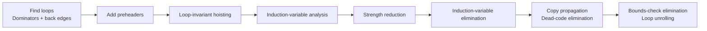

# Chapter 18: Loop Optimization

循环通常占据程序执行时间的大部分，因此编译器优化会优先盯住 loop。chap18 的主线是：

1. 先用 **dominators** 找出 loop；
2. 再在 loop 上做局部但高收益的优化：loop-invariant hoisting、induction-variable optimization、bounds-check elimination、loop unrolling。

---

## Loop 的控制流定义

直觉上，loop 是“一段反复执行的指令”。在控制流图中，loop 是一组节点 `S`，包含一个 header `h`，并满足：

- 从 `S` 中任意节点都能沿有向边到达 `h`；
- 从 `h` 能到达 `S` 中任意节点；
- 从 `S` 外进入 `S` 的边只能指向 `h`。

也就是说，header 是唯一入口；出口可以有多个。

<div align=center>

</div>

| 概念 | 含义 |
|---|---|
| **entry node** | loop 内部有来自 loop 外部前驱的节点 |
| **exit node** | loop 内部有指向 loop 外部后继的节点 |
| **nested loop** | 一个 loop 完全包含在另一个 loop 中 |

### Reducible flow graph

普通结构化控制流（`while`、`for`、`if`、`break` 等）通常产生 reducible flow graph。它的好处是：循环有清晰 header，很多 dataflow analysis 可以更高效地按特定顺序求解。

`goto` 或函数式语言中的任意 tail-call 结构可能产生 irreducible flow graph；本章算法尽量不依赖“图一定 reducible”。

---

## Dominators

为了找 loop，先定义支配关系。控制流图有一个 start node `s0`。

> 节点 `d` dominates 节点 `n`，当且仅当从 `s0` 到 `n` 的每条路径都必须经过 `d`。

性质：

- 每个节点支配自己；
- `s0` 支配所有可达节点；
- 一个节点可能有多个 dominator。

### 求 dominator 集合

令 `D[n]` 是所有支配 `n` 的节点集合：

$$
D[s_0] = \{s_0\}
$$

$$
D[n] = \{n\} \cup \bigcap_{p \in pred[n]} D[p] \quad (n \ne s_0)
$$

迭代算法：

```text
D[s0] <- {s0}
for n != s0:
    D[n] <- all nodes

repeat
    for n != s0:
        D[n] <- {n} union intersection(D[p] for p in pred[n])
until fixed point
```

这里初始化为全集，是因为每轮更新只会让集合变小。

### Immediate dominator 与 dominator tree

`idom(n)` 是 `n` 的唯一直接支配者：

- `idom(n) != n`；
- `idom(n)` 支配 `n`；
- `idom(n)` 不支配 `n` 的其他 dominator。

把每个节点 `n` 连到 `idom(n)`，得到 **dominator tree**。

<div align=center>

</div>

注意：dominator tree 的边不一定是控制流图中的真实边。例如 `idom(7)=4`，不代表 CFG 一定有 `4 -> 7`。

---

## Back Edge 与 Natural Loop

若 CFG 中有边 `n -> h`，且 `h` dominates `n`，则这条边是 **back edge**。

一个 back edge `n -> h` 的 **natural loop** 是所有满足下列条件的节点 `x`：

- `h` dominates `x`；
- 存在一条从 `x` 到 `n` 的路径，且路径不经过 `h`。

header 就是 `h`。

<div align=center>

</div>

同一个 header 可能对应多个 natural loop；实际构造 loop-nest tree 时，通常把相同 header 的 natural loops 合并。

### Loop-nest tree

构造 loop-nest tree 的流程：

1. 计算 CFG 的 dominators；
2. 构造 dominator tree；
3. 找所有 back edges 与 natural loops；
4. 对每个 header `h`，合并它的 natural loops，得到 `loop[h]`；
5. 若 `h2` 在 `loop[h1]` 中，则 `h1` 是 `h2` 的祖先。

loop-nest tree 的叶子就是 innermost loops，优化通常先从内层循环开始。

---

## Loop Preheader

很多循环优化需要在“循环开始之前”插入语句，例如把 loop-invariant computation 移到循环外。如果 loop header 有多个来自外部的前驱，就没有一个唯一位置可放这些语句。

解决方法：插入 **preheader** 节点 `p`。

- `p` 在 loop 外；
- `p -> h`；
- 所有来自 loop 外部的 `y -> h` 改成 `y -> p`；
- loop 内部的 back edge 仍然指向 `h`。

<div align=center>

</div>

preheader 是 loop optimization 的“停车位”：hoisting、strength reduction initialization、bounds-check guard 等都可以放在这里。

---

## Loop-Invariant Computations

若循环中有定义：

```text
t <- a op b
```

并且 `a`、`b` 每次迭代的值都相同，那么 `t` 也每次相同，可以考虑把它 hoist 到 preheader。

### 如何判断 loop-invariant

定义 `d: t <- a1 op a2` 在 loop `L` 中是 loop-invariant，当且仅当每个 operand `ai` 满足下列之一：

1. `ai` 是常量；
2. 所有 reaching definitions of `ai` 都在 loop 外；
3. 只有一个 reaching definition of `ai`，且该 definition 本身是 loop-invariant。

这自然导出迭代算法：先找常量/loop 外定义，再反复扩展依赖于已知 invariant 的定义，直到 fixed point。

### Hoisting 的安全条件

loop-invariant 不代表一定能移动。把 `d: t <- a op b` hoist 到 preheader 末尾，需要满足：

1. `d` dominates all loop exits where `t` is live-out；
2. loop 内只有一个 `t` 的定义；
3. `t` 不 live-out of the loop preheader。

<div align=center>

</div>

这三个条件分别避免：

| 条件 | 避免的问题 |
|---|---|
| dominates relevant exits | 原程序可能不执行该定义，移动后却执行了 |
| single definition | 多个 `t` 定义被移动后顺序改变 |
| not live-out of preheader | 循环第一次使用 `t` 时读到错误的旧值 |

!!! warning "隐式副作用"
    如果 `a op b` 可能溢出、除零或产生异常，即使结果 invariant，也不能随便 hoist。移动后可能让原本不会执行的异常提前发生。

### while 转 repeat-until

while loop 的出口常常在 header，loop body 中的语句不支配出口，因此 hoisting 条件很难满足。可以把 while 转成“前置 if + repeat-until”，通过复制 header test，让 body 语句支配循环出口，从而释放更多 hoisting 机会。

---

## Induction Variables

循环中常见变量：

```text
i <- i + c
j <- i * 4
k <- j + a
```

`i` 是基本归纳变量（basic induction variable），`j`、`k` 是由 `i` 推出的 derived induction variables。优化目标是把昂贵运算（如乘法）变成便宜运算（如加法），再删除多余 induction variables。

<div align=center>

</div>

### Basic induction variable

变量 `i` 是 loop `L` 中的 basic induction variable，如果它在 `L` 内的所有定义都形如：

```text
i <- i + c
i <- i - c
```

其中 `c` 是 loop-invariant。

### Derived induction variable

变量 `k` 是 derived induction variable，如果：

1. `k` 在 loop 内只有一个定义，且形如 `k <- j * c` 或 `k <- j + d`；
2. `j` 是 induction variable，`c` / `d` 是 loop-invariant；
3. 如果 `j` 本身是从 `i` 派生的，则从 `j` 的定义到 `k` 的定义之间不能再定义 `i`。

### Triple 表示

每个 induction variable 都可写成：

$$
x = a_x + i \cdot b_x
$$

用三元组表示为：

```text
(i, a_x, b_x)
```

基本归纳变量 `i` 本身是：

```text
(i, 0, 1)
```

若 `j` 的 triple 是 `(i, a, b)`：

| 定义 | `k` 的 triple |
|---|---|
| `k <- j * c` | `(i, a*c, b*c)` |
| `k <- j + d` | `(i, a+d, b)` |

---

## Strength Reduction

strength reduction 把 loop 内昂贵运算替换成便宜运算。典型目标：

```text
j <- i * 4
```

改成维护一个新变量 `j'`：

```text
preheader:
    j' <- a + i * b

loop:
    j <- j'
    ...
    i <- i + c
    j' <- j' + c * b
```

其中 `(i, a, b)` 是 `j` 的 triple。若 `c` 和 `b` 都是常量，`c*b` 可在编译期算出。

<div align=center>

</div>

在数组访问中：

```text
j <- i * 4
k <- j + a
x <- M[k]
```

可逐步变成：

```text
k' <- a
...
x <- M[k']
k' <- k' + 4
```

循环内乘法消失，只剩加法。

---

## Induction-Variable Elimination

strength reduction 之后，原来的 induction variable 可能已经没有实际用途。

### Useless variable

变量在 loop `L` 中 useless，如果：

- 它在所有 loop exits 处都是 dead；
- 它唯一用途是定义自己。

那么它的所有定义都可以删除。

### Almost useless variable

变量 `k` almost useless，如果：

- 只用于和 loop-invariant 值比较；
- 以及定义自己；
- 同一 induction family 中还有一个不 useless 的变量。

这时可以把比较改写成另一个 induction variable 的比较。

若 `j` 和 `k` 在同一 family 中且 coordinated：

$$
\frac{j-a_j}{b_j} = \frac{k-a_k}{b_k}
$$

比较 `k < n` 可改写为：

$$
j < \frac{b_j}{b_k}(n-a_k)+a_j
$$

如果 $\frac{b_j}{b_k}$ 为负数，比较方向要反过来。

限制：

- 若整数除法不能整除，不能产生 fractional value；
- 若 `b_j` 或 `b_k` 的符号在编译期无法确定，就不能确定比较方向。

<div align=center>

</div>

最后通常还需要 copy propagation 和 dead-code elimination 清理中间变量。

---

## Array-Bounds Checks

安全语言会在每次数组下标访问处插入 bounds check：

```text
0 <= i && i < N
```

很多检查是冗余的，但“删除所有冗余检查”不可判定。编译器常针对 induction variable 形式的下标做保守优化。

### 基本思路

如果 loop exit test 已经保证 `i` 在某个范围内，而数组访问下标 `k` 与 `i` 是同一 induction family 的变量，编译器可以尝试证明：

```text
每次执行 M[k] 时，都有 0 <= k < n
```

其中 `n` 常是数组长度。Tiger、Java、ML 这类语言中，数组长度在分配后不可变，因此 `length(A)` 常可视为 loop-invariant。

### 教材给出的典型条件

要删除 loop `L` 中的 bounds check，通常需要：

1. loop 有基于 induction variable `j` 和 loop-invariant `u` 的 exit test；
2. bounds check 使用 coordinated induction variable `k` 和 loop-invariant `n`；
3. exit test dominates bounds check；
4. 内层 loop 不重新定义 `k`；
5. `k` 随 `j` 同向变化，即 `b_j / b_k > 0`。

优化做法常是**复制 loop**：

- 原 loop `L` 保留 bounds check；
- 新 loop `L'` 删除 check；
- 在 preheader 加 guard，若能证明整轮循环都安全则进入 `L'`，否则进入 `L`。

若 guard 可在编译期确定，就可以只保留其中一个 loop。之后再跑 unreachable-code elimination 和 dead-code elimination。

!!! note "为什么这里很复杂?"
    bounds check elimination 必须证明每一次内存访问都安全。只知道 loop counter “大概在增长”不够，还要考虑中途增量、嵌套 loop、比较方向、数组长度是否可变、以及异常语义。

---

## Loop Unrolling

小循环的开销可能主要来自：

- counter increment；
- branch / exit test；
- loop back edge。

**Loop unrolling** 把多个循环体复制到同一次迭代中，减少分支频率。

### 直接展开可能没用

把 loop body 复制两份，但每份仍保留一次 increment 和 branch，收益很小：每个原始 iteration 仍然付出一次条件跳转。

### 有用的展开

要真正减少 branch，需要找到一个 induction variable `i`，使每个 `i <- i + Δ` 都 dominates every back edge。这样才能把多个 increment 合并：

```text
x <- M[i]
s <- s + x
x <- M[i + 4]
s <- s + x
i <- i + 8
if i < n goto L1 else L2
```

如果只这样做，可能只适用于原循环迭代次数为偶数的情况。稳健做法是加 epilogue，处理剩余的 “odd” iterations。

<div align=center>

</div>

若 unroll factor 是 `K`，epilogue 最多执行 `K-1` 次原始 loop body。

---

## 优化顺序与清理

这些优化常串在一起：



注意后续清理很重要：strength reduction 会引入新变量，bounds-check elimination 可能复制 loop，unrolling 会制造重复代码。没有 copy propagation、DCE、unreachable-code elimination，优化结果可能又大又丑。

---

## 小结

| 优化 | 依赖信息 | 核心收益 | 主要风险 |
|---|---|---|---|
| Dominator / natural loop | CFG | 找到 loop 和 loop nesting | 不可达节点会破坏某些定理 |
| Preheader | loop header | 给 hoisting/guard 初始化一个唯一位置 | 需要正确重定向外部入口边 |
| Loop-invariant hoisting | reaching definitions + liveness | 循环内重复计算变成一次计算 | 异常、副作用、未必执行的定义 |
| Strength reduction | induction variable triples | 乘法/地址计算变成加法 | 非线性 induction variable 不适用 |
| Induction-variable elimination | liveness + comparison rewriting | 删除多余计数器 | 整数除法、比较方向、符号未知 |
| Bounds-check elimination | induction variables + dominance | 删除安全冗余检查 | 证明条件复杂，必须保守 |
| Loop unrolling | induction variable + branch structure | 减少分支频率，暴露更多调度机会 | 代码膨胀，需要 epilogue 处理余数 |

要点：loop optimization 只有在 dominance、liveness、reaching definitions 和 induction-variable 关系都满足时，才能安全地改变执行次数和执行位置。
