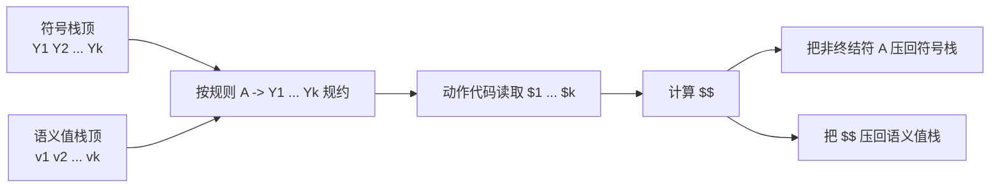

# Chapter 4: Abstract Syntax

语法分析器的工作不仅是判断输入句子是否属于文法，还需要在识别短语的同时为后续阶段提供有用的信息。在编译器前端中，这些后续工作通常包括构建抽象语法树、执行语义分析，以及生成中间表示 (IR)。因此，语法分析必须配合语义动作与抽象语法结构一起使用。

## Semantic Actions

语义动作 (Semantic Actions) 用来在“识别出某个短语”时立即做有意义的事情。对于每个终结符和非终结符，都可以关联一个语义值类型，这个类型来自编译器的实现语言，而不是来自源语言本身。

### Semantic Actions in Recursive Descent

在递归下降分析器中，语义动作通常体现为：

* 递归函数的返回值。
* 递归函数执行时产生的副作用。
* 返回值与副作用的组合。

例如，若我们希望在分析时直接计算表达式的值，那么：

* `NUM` 可以返回词法分析器给出的整数值。
* `ID` 可以先查符号表，再返回标识符所代表的值。
* `(E)` 可以直接返回内部表达式 `E` 的值。

在这种写法中，分析函数不只是“匹配文法”，还承担了“传递和组合语义值”的职责。

对于左结合运算符，一个常见技巧是把“已经算出来的左侧结果”作为参数传给右递归函数，例如 `Tprime(int a)`。这样即使文法为了消除左递归而改写成右递归形式，也仍然能得到左结合的语义效果。

```c
int T(void) {
    switch (tok) {
        case ID:
        case NUM:
        case LPAREN:
            return Tprime(F());
        default:
            print("expected ID, NUM, or left-paren");
            skipto(T_follow);
            return 0;
    }
}

int Tprime(int a) {
    switch (tok) {
        case TIMES:
            eat(TIMES);
            return Tprime(a * F());
        case PLUS:
        case RPAREN:
        case EOF:
            return a;
        default:
            ...
    }
}
```

对应

```
T -> F T'
T' -> * F T' | ε
```

### Semantic Actions in Yacc-Generated Parsers

在 Yacc 生成的分析器中，语义动作直接写在产生式后面的 `{ ... }` 中。常用记号如下：

* `$i`：规则右侧第 `i` 个符号的语义值。
* `$$`：规则左侧非终结符的语义值。
* `%union`：声明语义值可能携带的多种类型。
* `<variant>`：为终结符或非终结符指定具体使用哪一种语义值类型。

```yacc
%{
...
%}
%union { int num; string id; }
%token <num> INT
%token <id> ID
%type <num> exp
%left UMINUS
%%
exp: INT                  { $$ = $1; }
   | exp PLUS exp         { $$ = $1 + $3; }
   | exp MINUS exp        { $$ = $1 - $3; }
   | exp TIMES exp        { $$ = $1 * $3; }
   | MINUS exp %prec UMINUS { $$ = -$2; }
```

!!!Warning
    * `$$` 表示当前这条产生式规约完成后，左侧非终结符的语义值；`$1`、`$2`、`$3` 等表示右侧各个符号的语义值。
    * `$$` 到底代表“具体数值”还是 “AST 节点”，不是 Yacc 自动猜的，而是由文法声明决定的。
    * `%union` 先定义所有可能的语义值类型；然后用 `%token <...>` 和 `%type <...>` 指定每个终结符、非终结符到底使用哪一种类型。
    * 如果 `exp` 被声明成 `<num>`，那么 `$1`、`$3`、`$$` 就应当是整数；如果 `exp` 被声明成 `<exp>`，那么它们就应当是 AST 节点指针。
    * 同一个非终结符在同一套文法里通常只对应一种语义类型，因此 `exp: exp PLUS exp` 这一类规则里，`$$` 不应同时既表示整数结果，又表示 AST 节点。

Yacc 分析器会维护一个与状态栈平行的语义值栈：

* 当执行规约 `A -> Y1 ... Yk` 时，会从语义值栈弹出对应的 `k` 个值。
* 动作代码通过 `$1 ... $k` 访问这些值。
* 动作结束后，把 `$$` 对应的新值重新压回语义值栈。



因此，LR 分析器中的语义动作执行顺序是确定的：它跟随规约过程进行，本质上对应于对语法树的一种自底向上、从左到右、后序的遍历。

### Summary: Semantic Actions

* 每个终结符和非终结符都可以关联自己的语义值类型。
* 产生式左侧非终结符的语义值，需要由右侧各符号的语义值组合出来。
* 在 LR 分析器中，语义动作的执行顺序完全由规约顺序决定，因此是确定且可预测的。

## Abstract Parse Trees

理论上，可以把整套编译逻辑都塞进 Yacc 的语义动作里；但这种做法通常可读性差、可维护性差，而且会被迫按照“语法被识别出来的先后顺序”来完成所有语义处理。

例如：

```c
void foo() { bar(); }
void bar() { ... }
```

如果所有工作都写进语义动作，那么程序的分析方式会过度依赖源程序被解析出来的顺序，这不利于模块化。

更合理的做法是把语法问题与语义问题分离开：

* 解析器负责根据 concrete syntax 识别结构。
* 后续阶段负责遍历解析器构建出的树形结构，完成类型检查和翻译。

## Abstract Syntax

### Why

严格来说，普通语法分析树有：

* 输入中每个 token 对应的一个叶子节点。
* 每次规约产生的一个内部节点。

这样的树称为具体语法树 (Concrete Parse Tree)，它直接反映源语言的 concrete syntax。

但具体语法树不适合直接交给后续阶段使用，原因包括：

* 含有许多对后续阶段无意义的冗余 token，例如括号 `(`、`)`。
* 占用更多内存。
* 结构过于依赖文法形式。
* 一旦文法改写，树的结构也会跟着变化。

### What

抽象语法 (Abstract Syntax) 为解析器与后续编译阶段之间提供了更干净的接口。

* 它不是拿来做 parsing 的。
* 解析器仍然使用 concrete syntax 来识别输入。
* 但解析器最终构建的是抽象语法树 (Abstract Syntax Tree, AST)。

AST 只保留程序的短语结构，解析中的优先级、结合性、括号等语法细节都已经被解决，而不再保留到树结构里。

## Abstract Syntax Tree (AST)

### AST 的数据结构

为了让后续阶段能够操作 AST，编译器需要把 AST 明确表示成数据结构。一个常见做法是：

* 为每个非终结符定义一个 `typedef`。
* 为该非终结符的每个产生式定义一个 `union` 分支。

```c
typedef struct A_exp_ *A_exp;
struct A_exp_ {
    enum {A_numExp, A_plusExp, A_timesExp} kind;
    union {
        int num;
        struct {A_exp left; A_exp right;} plus;
        struct {A_exp left; A_exp right;} times;
    } u;
};

A_exp A_NumExp(int num);
A_exp A_PlusExp(A_exp left, A_exp right);
A_exp A_TimesExp(A_exp left, A_exp right);
```

构造函数通常负责分配节点并填写字段，例如：

```c
A_exp A_PlusExp(A_exp left, A_exp right) {
    A_exp e = checked_malloc(sizeof(*e));
    e->kind = A_plusExp;
    e->u.plus.left = left;
    e->u.plus.right = right;
    return e;
}
```

### AST 构造示例

对表达式 `2 + 3 * 4`，根据 concrete syntax 中已经处理好的优先级关系，应先构造乘法节点，再构造加法节点：

```c
e1 = A_NumExp(2);
e2 = A_NumExp(3);
e3 = A_NumExp(4);
e4 = A_TimesExp(e2, e3);
e5 = A_PlusExp(e1, e4);
```

这里构造的是树结构，而不是直接计算出数值。

### AST 的自动构建

AST 可以在语法分析的同时自动构建。无论是递归下降分析器还是 Yacc 生成的分析器，都可以在识别 concrete syntax 时立即返回 AST 节点。

```yacc
%left PLUS
%left TIMES
%%
exp : NUM              { $$ = A_NumExp($1); }
    | exp PLUS exp     { $$ = A_PlusExp($1, $3); }
    | exp TIMES exp    { $$ = A_TimesExp($1, $3); }
```

这种写法的要点是：底层子树在规约时先构造出来，再逐步组装成更高层的父节点。

## Positions

在 one-pass compiler 中，词法分析、语法分析和语义分析可以几乎同时进行，因此词法分析器维护的“当前位置”通常还能近似表示当前错误的位置。

但对于使用 AST 的多遍编译器，这种方法就不够了：

* 解析完成后，词法分析器往往已经到达 EOF。
* 后续语义分析是在更晚的时候遍历 AST 才进行的。
* 如果这时发现类型错误，仅靠 lexer 的全局当前位置已经无法指出真正出错的源码位置。

### Why Positions Must Be Stored

因此，AST 中的每个节点都应当保存它来源于源文件中的哪个位置。常见做法是在抽象语法数据结构中加入 `pos` 字段，记录该节点对应的源码字符位置、行号，或者“行号 + 行内位置”。

### How Positions Are Propagated

为了给 AST 节点正确填写 `pos`，需要两步：

* 词法分析器把每个 token 的起始和结束位置传给解析器。
* 解析器在执行语义动作时，把合适的位置附着到新建的 AST 节点上。

理想情况下，解析器应当像维护语义值栈一样，额外维护一个位置栈，让每个文法符号的位置都能被动作代码访问。

* Bison 可以直接支持这种机制。
* 标准 Yacc 不支持内建的位置栈。

### A Common Yacc Technique

在 Yacc 中，一个常见技巧是额外定义一个非终结符 `pos`，它的语义值就是当前位置。这样就可以在需要的地方显式把位置信息插进产生式里。

```yacc
%{ extern A_OpExp (A_exp,A_binop,A_exp,position); %}
%union { int num; string id; position pos; ... };
%type <pos> pos

pos: { $$ = EM_tokpos; }
exp: exp PLUS pos exp { $$ = A_OpExp($1, A_plus, $4, $3); }
```

这里的 `pos` 就负责把 `PLUS` 附近的源码位置捕获下来，再交给 AST 构造函数保存。
