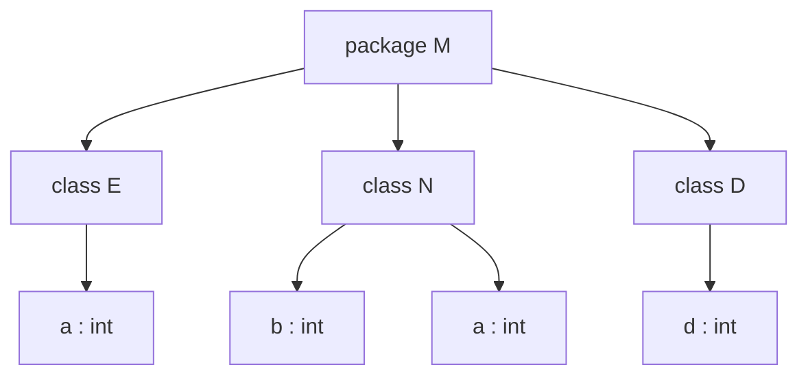
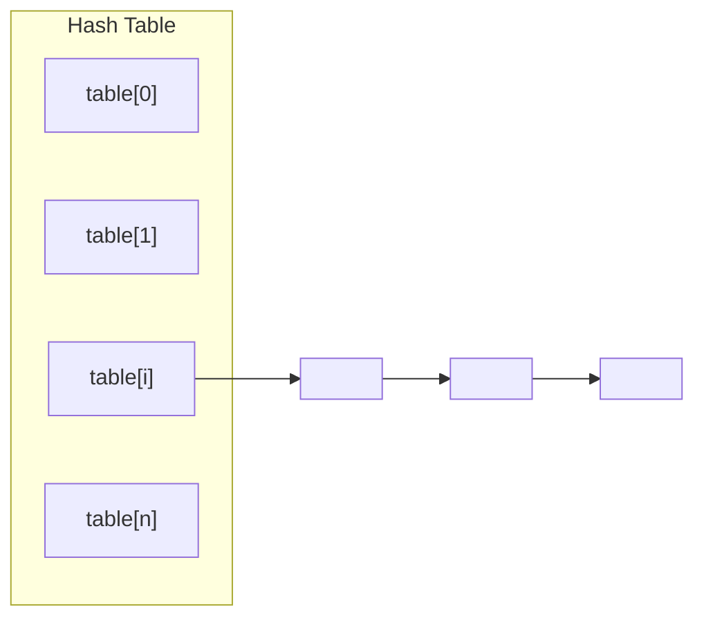
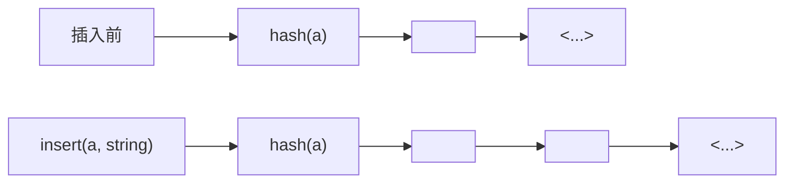
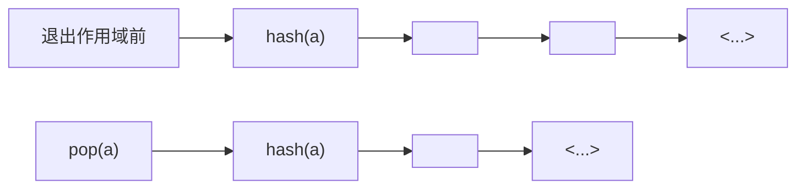
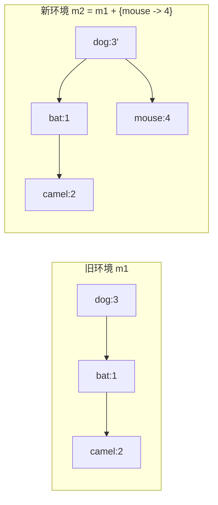
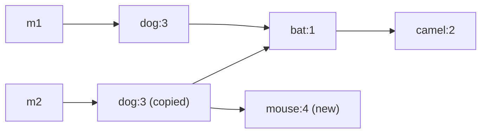

# Chapter 5: Semantic Analysis

语义分析 (Semantic Analysis) 处在语法分析之后、IR 生成之前。到这一阶段，编译器已经知道输入程序的短语结构，但还不知道这些短语在语义上是否成立，例如变量是否声明、表达式类型是否匹配、递归类型是否合法、函数调用是否满足形参与返回值约束。

> CFG 只能告诉我们“长得像不像一个句子”，但不能告诉我们“这个句子在程序语言里有没有意义”。

---

## Why Semantic Analysis

先看一个典型例子：

```tig
string x;
int z;
x := "hello world";
z := x + 1
```

从纯语法角度看，它完全可能满足某个表达式文法；但从语义角度看，`x + 1` 明显不合法，因为 `x` 是字符串而不是整数。

因此，很多重要性质都不能只靠 CFG 判断：

* 变量是否先声明后使用。
* 表达式两侧的类型是否兼容。
* 函数实参与形参是否匹配。
* 递归类型是否合法。
* 标识符在当前作用域中到底绑定到哪个定义。

语义分析阶段通常承担两类任务：

1. 基于 AST 推出程序的静态性质。
2. 把 AST 翻译成更适合后端处理的中间表示。

---

## Symbol Tables

### Binding, Environment, Scope

语义分析最基本的动作，是把一个名字绑定到某种“含义”上。

例如：

* 类型标识符 `int` 绑定到某个类型对象。
* 变量标识符 `x` 绑定到“类型 + 存储信息”等属性。
* 函数标识符 `f` 绑定到“形参类型列表 + 返回类型”。

这种映射关系称为 binding，记作：

\[
x \mapsto int
\]

多个 binding 组成 environment，environment 的具体实现就是 symbol table。

!!!Definition
    * `Binding`: 给一个符号赋予含义。
    * `Environment`: 一组当前生效的 binding。
    * `Symbol Table`: environment 的实现结构。

作用域 (scope) 则描述了“这个 binding 在程序的哪一段区域内可见”。

例如在 `let ... in ... end` 中，进入 `let` 体时会扩展环境，离开 `end` 时再恢复旧环境。

<div align="center">
    
</div>


1. 读到声明时，把新名字加入环境。
2. 读到使用时，在当前环境里查找该名字。
3. 离开作用域时，丢弃该作用域内新增的 binding。

### Shadowing

如果内层作用域重新声明了同名标识符，那么新绑定会遮蔽旧绑定：

```tig
let
    var a := 1
    var a := "hello"
in
    ...
end
```

在内层环境中，`a` 绑定到 `string`，而不是外层的 `int`。这说明：

* `X + Y` 不是交换的。
* 右侧新加入的 binding 会覆盖左侧已有 binding 的可见性。

### Symbol Table Needs

一个可用的符号表至少要支持四个操作：

* `insert`: 插入新 binding。
* `lookup`: 查询名字当前对应的属性。
* `beginScope`: 进入新作用域。
* `endScope`: 退出作用域并恢复旧环境。

如果语言有模块、类、记录等结构，还可能同时存在多个活跃环境。此时“一个程序只有一张符号表”就不够了，更准确的说法是：

* 每个命名空间或结构单元都可能有自己的局部环境。
* 语义分析器需要知道当前在哪个环境中查找名字。

### Multiple Symbol Tables

当语言支持 `package`、`class`、`module` 这类封装结构时，符号表的使用方式需要从“单个作用域栈”扩展成“多层环境嵌套”。


* 类内部成员放在该类自己的 symbol table 里。
* 外层包或模块环境不直接保存每个成员，而是保存“类名 -> 该类的局部环境”。
* 形如 `E.a` 的访问，本质上是先查到 `E` 对应的类环境，再在这个局部环境里查找 `a`。

例如：

```java
package M;
class E {
    static int a = 5;
}
class N {
    static int b = 10;
    static int a = E.a + b;
}
class D {
    static int d = E.a + N.a;
}
```

每个类一张表，包 `M` 再维护一张更外层的表”：

<div align="center">



</div>


\[
\sigma_1 = \{ a \mapsto int \}
\]

\[
\sigma_2 = \{ E \mapsto \sigma_1 \}
\]

\[
\sigma_3 = \{ b \mapsto int,\ a \mapsto int \}
\]

\[
\sigma_4 = \{ N \mapsto \sigma_3 \}
\]

\[
\sigma_5 = \{ d \mapsto int \}
\]

\[
\sigma_6 = \{ D \mapsto \sigma_5 \}
\]

\[
\sigma_7 = \sigma_2 + \sigma_4 + \sigma_6
\]

这里的含义是：

* 分析 `E.a` 时，先在包环境里查 `E`，得到 `σ1`，再在 `σ1` 中查 `a`。
* 分析 `N.a` 时，先查 `N`，得到 `σ3`，再在 `σ3` 中查 `a`。

对于 Java 这种允许前向引用的语言，一个常见做法是先收集所有类头部，形成包级环境，再分别分析类体。这样在分析 `D` 时，即使 `N` 的定义写在前面或后面，`N.a` 仍然能通过包环境被解析到。

---

## How To Implement Symbol Tables

实现方式分成两种风格：命令式 (imperative) 与函数式 (functional)。

### Imperative Style

命令式风格直接修改当前符号表：

* 进入作用域时，往表里插入新 binding。
* 退出作用域时，利用辅助信息撤销这些插入。

优点是实现直接；缺点是旧环境被破坏，恢复必须依赖额外机制。

在 Tiger 编译器的 C 实现中，环境使用的是 destructive-update 风格。

#### Hash Table with External Chaining

因为标识符可能非常多，`lookup` 必须足够快，所以常见实现是散列表加链地址法：

```c
struct bucket {
    string key;
    void *binding;
    struct bucket *next;
};
```

插入时把新结点挂到桶链表表头，这样天然支持“新 binding 遮蔽旧 binding”：

```c
void insert(string key, void *binding) {
    int index = hash(key) % SIZE;
    table[index] = Bucket(key, binding, table[index]);
}
```

“数组 + 桶链表”：

<div align="center">



</div>

这里真正保存 binding 的不是数组槽位本身，而是槽位指向的链表。哈希冲突的元素会挂在同一个桶里，而同名标识符的新旧绑定也可以借助“头插法”自然叠起来。

如果原来已经有：

\[
a \mapsto int
\]

再插入：

\[
a \mapsto string
\]

桶里会变成：

```text
<a, string> -> <a, int>
```

`lookup(a)` 只会先看到新的 `string` 绑定。等当前作用域结束后，`pop` 掉表头，就能恢复旧环境。


<div align="center">



</div>

因此命令式符号表里“进入作用域”并不需要复制整张表，它只是在对应桶的表头再压入一个更新版本。

如果离开这个作用域，只需把头结点弹掉：

<div align="center">



</div>

命令式风格需要“辅助信息”来恢复旧环境: 新 binding 的压入和弹出，本质上是一个按作用域边界管理的栈行为。

### Functional Style

函数式风格不修改旧环境，而是构造一个新环境：

\[
s' = s + \{a \mapsto \tau\}
\]

这样 `s` 仍然可用，退出作用域时只需回到旧指针即可，不需要“撤销修改”。

但如果直接拿哈希表做纯函数式更新，往往要复制整张数组，成本偏高。因此更适合配合共享结构的搜索树来做持久化环境。

如果用二叉搜索树表示 environment，插入时只需要复制“从根到插入位置”这一条路径，未修改的子树可以直接共享：

<div align="center">



</div>

更准确地说，`m2` 中只有根到插入点路径上的结点是“新分配”的，其他未改动的子树都可以继续复用 `m1`。逻辑上可以理解成下面这种共享关系：

<div align="center">



</div>

* `m1` 仍然可用，因为它的根指针没变。
* `m2` 只复制了必要路径，因此不是“整棵树完全拷贝”。
* 退出作用域时不需要做 `pop`，只要回到旧根指针 `m1` 即可。

### Comparison

| 风格 | 进入作用域 | 退出作用域 | 优点 | 代价 |
| --- | --- | --- | --- | --- |
| 命令式 | 原地插入 | 撤销插入 | 常数小，实现直接 | 需要维护恢复机制 |
| 函数式 | 构造新表 | 回退到旧表 | 旧环境天然保留 | 需要共享结构支撑效率 |

---

## Symbols in The Tiger Compiler

工程上的优化：不在符号表中反复比较字符串，把字符串 intern 成 symbol。

### Why Symbol Instead of String

如果每次 `lookup("counter")` 都要做字符串比较，会比较慢。更高效的做法是：

* 每个不同字符串只创建一个 `S_symbol` 对象。
* 相同字符串总是映射到同一个 `S_symbol`。
* 之后比较两个名字是否相等，只需比较指针或整数 key。

这样做的直接收益是：

* 哈希更快。
* 相等判断更快。
* 如果使用搜索树，大小比较也更容易定义。

### Tiger 的接口

```c
typedef struct S_symbol_ *S_symbol;
S_symbol S_Symbol(string name);
string S_name(S_symbol sym);

typedef struct TAB_table_ *S_table;
S_table S_empty(void);
void S_enter(S_table t, S_symbol sym, void *value);
void *S_look(S_table t, S_symbol sym);
void S_beginScope(S_table t);
void S_endScope(S_table t);
```

这里 `void *value` 非常关键，因为同一个表框架需要服务于多种 binding：

* 类型环境里，`value` 对应 `Ty_ty`。
* 值环境里，`value` 对应变量或函数条目。

Tiger 把“名字管理”与“名字绑定到什么属性”这两件事分离开了。

---

## Type System in Tiger

### Tiger 的类型有哪些

Tiger 的类型可以分为两层：

* 原始类型：`int`、`string`
* 构造类型：`record`、`array`

同时还会在实现里显式表示：

* `nil`
* `void`
* `name`，也就是类型别名或递归类型占位符

内部表示如下：

```c
typedef struct Ty_ty_ *Ty_ty;
struct Ty_ty_ {
    enum {
        Ty_record, Ty_nil, Ty_int, Ty_string,
        Ty_array, Ty_name, Ty_void
    } kind;
    union {
        Ty_fieldList record;
        Ty_ty array;
        struct {S_symbol sym; Ty_ty ty;} name;
    } u;
};
```

Tiger 的类型检查不是在字符串层面做的，而是在一套显式的类型对象上做的。

### Name Equivalence

!!!info "name equivalence vs structural equivalence"
    - Name equivalence (NE): T1 and T2 are equivalent iff T1 and T2 are identical type names defined by the exact same type declaration.

    - Structural equivalence (SE): T1 and T2 are equivalent iff T1 and T2 are composed of the same constructors applied in the same order.

Tiger 采用名字等价 (name equivalence)，不是结构等价 (structural equivalence)。


```tig
let
    type a = {x:int, y:int}
    type b = {x:int, y:int}
    var i : a := ...
    var j : b := ...
in
    i := j
end
```

这在 Tiger 中是非法的。因为 `a` 和 `b` 虽然结构相同，但它们来自两个不同的类型声明。

而下面是合法的：

```tig
let
    type a = {x:int, y:int}
    type b = a
    var i : a := ...
    var j : b := ...
in
    i := j
end
```

因为 `b` 只是 `a` 的别名。

### Two Namespaces

Tiger 有两套名字空间：

* 类型名字空间
* 变量/函数名字空间

所以这段代码是允许的：

```tig
let
    type a = int
    var a := 1
in
    ...
end
```

两个 `a` 不冲突，因为它们属于不同 namespace。

```tig
let function a (b: int) = ...
 var a := 1
in ...
end
```

这样就不合法了，因为函数 `a` 和变量 `a` 冲突了。

---

## Two Environments For Type Checking

Tiger 的语义分析维护两张环境表：

### Type Environment: `tenv`

`tenv` 负责：

* `type symbol -> Ty_ty`

例如：

* `int -> Ty_Int()`
* `string -> Ty_String()`
* `list -> Ty_Name(...)`

### Value Environment: `venv`

`venv` 负责：

* 变量：`symbol -> E_VarEntry(Ty_ty)`
* 函数：`symbol -> E_FunEntry(formals, result)`


```c
typedef struct E_enventry_ *E_enventry;
struct E_enventry_ {
    enum {E_varEntry, E_funEntry} kind;
    union {
        struct {Ty_ty ty;} var;
        struct {Ty_tyList formals; Ty_ty result;} fun;
    } u;
};
```

!!!Question
    为什么 `venv` 不直接把变量名映射到“类型名字符串”？

答案是：类型检查最终要比较的是类型对象，而不是表面名字。直接保存 `Ty_ty` 才能统一处理别名、递归类型与实际类型展开。

---

## The Four Core Semantic Functions

Tiger 的语义分析核心由四个递归函数组成：

```c
struct expty transVar(S_table venv, S_table tenv, A_var v);
struct expty transExp(S_table venv, S_table tenv, A_exp a);
void transDec(S_table venv, S_table tenv, A_dec d);
Ty_ty transTy(S_table tenv, A_ty a);
```

其中：

* `transVar` 处理左值。
* `transExp` 处理表达式。
* `transDec` 处理声明并更新环境。
* `transTy` 把语法里的类型描述翻译成内部 `Ty_ty`。

表达式翻译结果通常打包成：

```c
struct expty {
    Tr_exp exp;
    Ty_ty ty;
};
```

这说明语义分析和 IR 生成在实现上常常是并行推进的：

* `exp` 是中间表示。
* `ty` 是该表达式的静态类型。


---

## Type Checking Expressions

### Non-overloaded Operators

Tiger 的 `+` 不是重载运算符，因此：

* `e1 + e2` 要求 `e1`、`e2` 都是 `int`
* 整个表达式结果也是 `int`

所以 `transExp` 在处理 `A_opExp` 时，必须：

1. 递归检查左右子表达式。
2. 检查两边类型是否满足运算符约束。
3. 返回结果类型。

这类规则本质上就是静态语义规则。

### L-values

Tiger 中的左值包括三种：

```text
lvalue -> id
       | lvalue.id
       | lvalue[exp]
```

也就是：

* 普通变量
* 记录字段
* 数组下标

因此 `transVar` 要递归判断：

* 这个名字是否存在。
* 被点选时左侧是不是 `record`。
* 被下标时左侧是不是 `array`。
* 下标表达式本身是不是 `int`。

如果变量不存在，编译器通常会报错，但为了不中断后续分析，仍会返回一个默认类型继续向下走。

---

## Type Checking Declarations

在 Tiger 中，声明只出现在 `let decs in body end` 里，所以声明处理本质上就是“进入新作用域并扩展环境”。

```c
case A_letExp: {
    struct expty exp;
    A_decList d;
    S_beginScope(venv);
    S_beginScope(tenv);
    for (d = a->u.let.decs; d; d = d->tail)
        transDec(venv, tenv, d->head);
    exp = transExp(venv, tenv, a->u.let.body);
    S_endScope(tenv);
    S_endScope(venv);
    return exp;
}
```

### Variable Declarations

对于：

```tig
var x := exp
```

流程是：

1. 先检查初始化表达式 `exp`。
2. 得到其类型 `e.ty`。
3. 把 `x -> E_VarEntry(e.ty)` 加入 `venv`。

如果有显式类型约束：

```tig
var x : type_id := exp
```

还要额外检查：

* 约束类型与初始化表达式类型是否兼容。
* 若初始化表达式是 `nil`，则约束类型必须是某种 `record`。

### Type Declarations

对于：

```tig
type a = ty
```

需要调用 `transTy`，把语法中的 `ty` 翻译为内部 `Ty_ty`，再放入 `tenv`。

### Function Declarations

对于：

```tig
function f(a: ta, b: tb): rt = body
```

语义分析至少要做四件事：

1. 在 `tenv` 中查到返回类型 `rt`。
2. 把形参列表翻译成 `Ty_tyList`。
3. 在 `venv` 中登记 `f` 的函数条目。
4. 打开函数体局部作用域，把每个形参加入 `venv`，再检查 `body`。

真正完整的实现还要额外检查：

* 函数体结果是否与声明返回类型一致。
* 是否有重名函数。
* 参数类型是否都存在。

---

## Recursive Declarations


### Recursive Types

考虑：

```tig
type list = {first: int, rest: list}
```

如果我们试图一步完成翻译，就会遇到悖论：

* 要翻译右侧 `{first: int, rest: list}`
* 就得先知道 `list` 是什么
* 但 `list` 正在被定义，还没进环境

标准解法是两遍处理：

<div align="center">
    
</div>

第一遍只登记头部：

```c
S_enter(tenv, name, Ty_Name(name, NULL));
```

这里的 `Ty_Name(name, NULL)` 只是一个占位符，表示“这个类型名存在，但实体稍后再补”。

第二遍再翻译右侧真正的类型体，并把结果回填到这个占位符中。

### Illegal Type Cycles

Tiger 还要求：互相递归的类型声明中，每个环都必须经过 `record` 或 `array`。

例如下面这种纯别名环是非法的：

```tig
type a = b
type b = a
```

因为如果不经过真正的构造子，类型展开永远不会停下来。

### Mutually Recursive Functions

互相递归的函数也需要两遍处理。例如 `f` 调 `g`、`g` 调 `f`：

* 如果在检查 `f` 的函数体时，`g` 还没登记进 `venv`，就会报未定义。

因此也必须：

1. 第一遍收集所有函数头部信息：函数名、参数类型、返回类型。
2. 第二遍在环境完整的前提下检查所有函数体。

递归类型与递归函数本质上是同一个模式：

> 先把可被引用的“头部信息”放进环境，再检查真正依赖这些头部的“主体内容”。

---