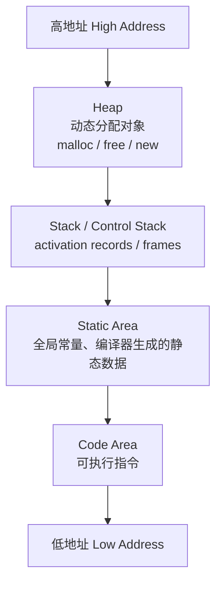
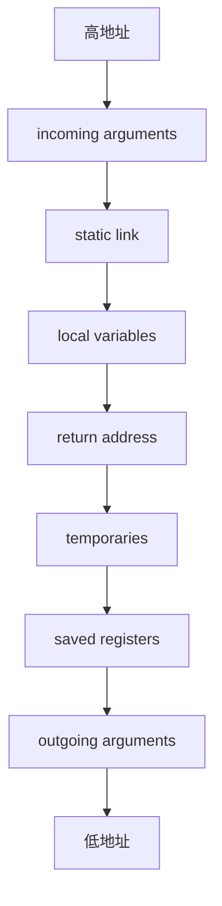
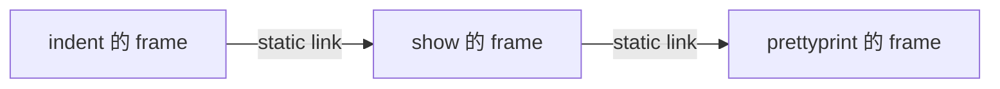
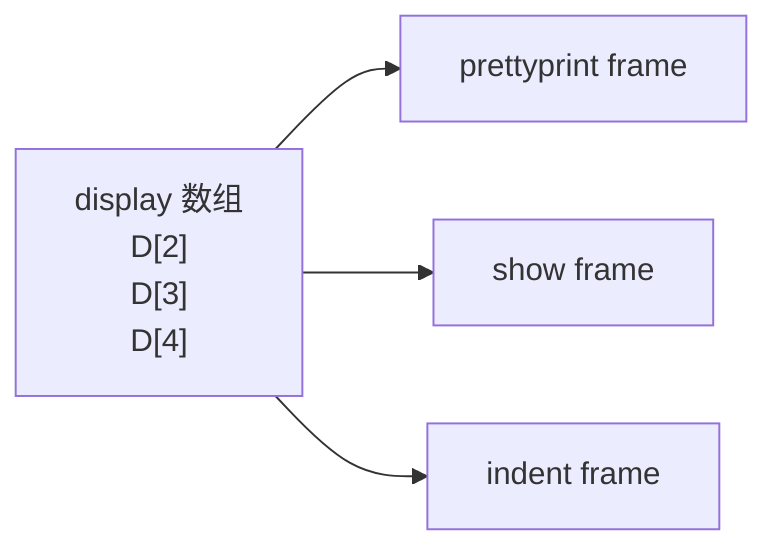
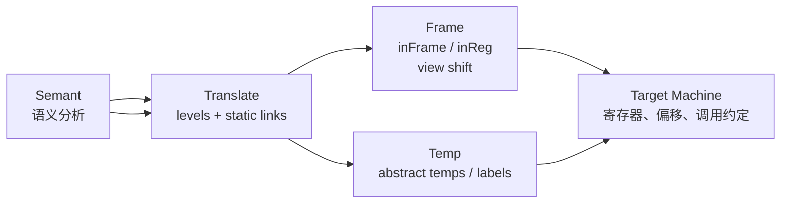

# Chapter 6: Activation Records

## Why This Chapter Matters

语义分析结束后，编译器已经知道：

- 一个变量的类型是什么。
- 一个函数有哪些形参和返回值。
- 一个变量会不会 escape。
- 哪些函数嵌套在别的函数内部。

但这些信息还只是“静态知识”。到了运行时，还要进一步回答：

- 递归调用时，多份同名局部变量如何共存？
- 函数返回后，哪些值应该立刻消失，哪些值必须继续活着？
- 参数放寄存器还是放内存？
- 嵌套函数如何访问外层函数的变量？

这些问题共同决定了 frame layout、calling convention 和 static link 的设计。

---

## 运行时存储组织

从编译器视角看，目标程序运行在自己的逻辑地址空间中。常见划分如下：

<div aligin="center">



</div>

各区域职责不同：

- `Code`：目标代码本体。
- `Static`：大小在编译期已知的对象，如全局常量、字符串字面量、编译器生成的表。
- `Stack`：函数调用期间创建和销毁的 activation records。
- `Heap`：由程序显式控制生命周期的对象。

---

## Activation 与 Control Stack

设有递归函数：

```tig
function f(x: int): int =
let
    var y := x + x
in
    if y < 10 then f(y) else y - 1
end
```

每次调用 `f` 时，都会出现一份新的 `x` 和 `y`。因此：

- 一次函数调用称为一次 **activation**。
- 每个仍然存活的 activation 都需要自己的运行时存储空间。
- 由于调用/返回天然满足 LIFO，最合适的数据结构就是 **stack**。

因此，过程调用通常由一条 **control stack** 管理。每个 live activation 在栈上拥有一个 activation record，也叫 **frame**。

---

## 什么是 Stack Frame

一个函数的 stack frame 是该函数在栈上占用的那一块区域，通常包含：

- incoming arguments
- local variables
- return address
- temporaries
- saved registers
- outgoing arguments
- static link

可以抽象成下面这个布局：



要点有两个：

1. 栈通常在进入函数时一次性增长足够大的空间，在退出时一次性缩回。
2. frame 的设计目的是把 caller 和 callee 接起来，让参数传递、返回控制流和局部变量访问都可预测。

---

## 4. Stack Pointer 与 Frame Pointer

把“栈是一个 push/pop 结构”理解成“栈是一段连续数组”更有帮助。于是会出现两个关键寄存器：

- `SP`：stack pointer，指向当前栈顶附近的位置。
- `FP`：frame pointer，作为当前 frame 的稳定基准点。

典型进入/退出过程：

```text
进入 f:
1. 保存旧 FP
2. FP = SP
3. SP = SP - frameSize

退出 f:
1. SP = FP
2. 恢复旧 FP
```


为什么需要 `FP`？

- `SP` 会随着压栈/出栈而变化，不稳定。
- 局部变量相对 frame 基址的偏移在编译期是已知的。
- 因此即使 `FP` 的实际值要到运行时才能确定，`offset(FP)` 仍可在编译期固定下来。

!!! note
    如果某个机器的 frame 大小固定，`FP` 甚至可以是一个“虚构寄存器”：实际实现里只要能稳定表达“相对于当前 frame 基址的偏移”即可。

---

## 寄存器、caller-save 与 callee-save

寄存器比内存快得多，因此编译器总想把更多值留在寄存器里。但寄存器是所有函数共享的，于是产生一个约定问题：

如果 `f` 在寄存器 `r` 中保存了局部值，并调用 `g`，而 `g` 也想使用 `r`，谁负责保存原值？

- **caller-save**：调用者 `f` 负责在调用前保存、调用后恢复。
- **callee-save**：被调用者 `g` 负责进入时保存、退出时恢复。

这本质上是 calling convention 的一部分。编译器后续做寄存器分配时，必须遵守这种约定。

---

## 参数传递

Tiger 采用 **pass-by-value**：

- 传递的是实参的值。
- 修改形式参数不会影响实参本体。

现代机器通常不会把所有参数都压栈，而会采用“前几个参数走寄存器，其余参数走内存”的 convention。例如前 `k` 个参数通过寄存器传递，剩余参数再放入内存。

这样做的好处是快，但会引出一个典型问题：

```c
void f(int a) {
    int z = ...;
    h(z);
    int t = a + 2;
}
```

如果 `a` 本来就在参数寄存器 `r1` 中，而 `f` 调用 `h(z)` 时也必须把 `z` 放到 `r1`，那么 `a` 看起来就得先被写回 frame，调用后再恢复。

课程里给出了几种减少这类额外内存流量的方法：

1. `a` 在调用点之后已经 dead，可以直接覆盖。
2. leaf procedure 不需要为了后续调用而把参数写回内存。
3. inter-procedural register allocation 可以在全程序范围内协调寄存器使用。
4. 某些体系结构提供 register windows。

---

##  取地址、引用传参与返回地址

### 为什么“有地址的参数”必须落内存

若语言允许取参数地址，例如：

```c
int *f(int x) { return &x; }
```

如果 `x` 只活在寄存器里，就根本没有一个稳定内存地址可返回。因此：

- 任何“地址被取走”的参数或局部变量，都必须在 frame 中占有实际槽位。
- 否则就无法支持 `&x` 这种操作。

这也解释了 **dangling reference** 的来源：函数返回后，它的 frame 消失，之前返回出去的局部地址就悬空了。

### Call-by-Reference

call-by-reference 直接传地址而不是传值：

- 被调函数拿到的是实参位置。
- 对形参的读写会间接作用于实参。
- 因而每次访问形参都隐含一次解引用。

### Return Address

当 `g` 调用 `f` 时，`f` 返回后必须知道“跳回哪里”。这就是 **return address**。

现代机器通常在 `call` 指令执行时把返回地址写入专用寄存器，例如 MIPS 的 `$ra`。

- leaf procedure 通常可以一直把返回地址留在寄存器里。
- non-leaf procedure 因为还要继续调用别人，往往必须把它保存进自己的 frame。

---

## 哪些变量必须住在 Frame 中

现代 convention 往往会：

- 用寄存器传参数。
- 用寄存器保存返回地址。
- 用寄存器返回函数结果。

因此不是所有局部变量都要放在 frame 里。只有在必要时才写入内存。典型情况包括：

- 变量按引用传递。
- 变量地址被取走。
- 变量会被嵌套函数访问。
- 变量过大，单个寄存器放不下。
- 变量是数组，需要地址运算。
- 某寄存器因参数传递等原因被迫让位。
- 寄存器不够，多出来的值被 spill 到 frame。

这可以概括成一个关键词：**escape**。

!!! definition
    一个变量 escape，当且仅当它的生命周期或可访问范围超出了“当前过程内、当前寄存器里立即可用”的假设。常见原因是按引用传递、被取地址、或被嵌套函数使用。

---

## 嵌套函数与 Static Link

对于 Tiger、Pascal、ML 这种允许嵌套函数声明的语言，内层函数可以访问外层函数的变量。例如：

```tig
function prettyprint(tree: tree): string =
let
    var output := ""

    function write(s: string) =
        output := concat(output, s)

    function show(n: int, t: tree) =
    let
        function indent(s: string) =
            (for i := 1 to n do write(" ");
             output := concat(output, s);
             write("\n"))
    in
        ...
    end
in
    show(0, tree);
    output
end
```

问题在于：

- `write` 需要访问 `prettyprint` 里的 `output`。
- `indent` 同时需要访问 `show` 的 `n` 和 `prettyprint` 的 `output`。

这时仅靠“当前 frame 的 `FP + offset`”还不够，因为它们并不都在当前 frame 里。

### Static Link 的定义

当函数 `f` 被调用时，额外传入一个指针，指向 **源码中直接包围 `f` 的外层函数** 最近一次 activation record。这个指针就叫 **static link**。



于是：

- `show` 的 static link 指向 `prettyprint` 的 frame。
- `indent` 的 static link 指向 `show` 的 frame。
- 若 `indent` 想访问 `output`，先顺着 static link 到 `show`，再继续到 `prettyprint`。

### 访问规则

如果当前函数位于嵌套深度 `n`，访问一个声明于深度 `m` 的变量，则：

- 先沿着 static link 向外跳 `n - m` 次。
- 到达正确 frame 后，再通过已知偏移取变量。

### 优缺点

优点：

- 参数传递额外开销较小。
- 实现直观，尤其适合 Tiger 这类教学编译器。

缺点：

- 每次访问非局部变量都可能要走多次间接寻址。
- 嵌套深度越深，访问成本越高。

---

## Display 与 Lambda Lifting

实现 block structure 不止 static link 一种办法。

### Display

display 可以看作“按静态深度索引的全局数组”，`display[i]` 指向最近一次进入、且静态深度为 `i` 的函数 frame。



特点：

- 按深度访问更直接。
- 但维护 display 需要额外的更新逻辑。

### Lambda Lifting

另一种思路是根本不保留“非局部变量访问”这个语义，而是把它改写成显式参数传递。

例如：

```c
int g(int z) {
    int h() { return m + z; }
}
```

可改写成：

```c
int g(int &m, int z) {
    int h(int &m, int &z) { return m + z; }
}
```

核心思想：

- 把外层变量变成内层函数的额外形参。
- 由编译器做程序变换，从最内层函数开始逐层外提。

这就是 **lambda lifting**。

---

## 高阶函数为什么会打破“栈足够”

如果语言同时支持：

- 嵌套函数
- 函数作为返回值或一等值

那么单靠 stack 就不够了。

例如：

```ml
fun f(x) =
let
    fun g(y) = x + y
in
    g
end
```

当 `f` 返回后，`g` 仍然可能继续被调用，而 `g` 又需要访问 `x`。如果 `x` 只放在 `f` 的栈帧里，那么 `f` 一返回，`x` 就没了。

因此：

- Pascal 有嵌套函数，但函数通常不能作为返回值。
- C 可把函数指针当值，但没有真正的嵌套函数。
- ML、Scheme 这类语言同时具备二者，于是必须引入 closure 等更复杂的运行时表示。

---

## Tiger 编译器中的 Frame 抽象

Appel 在 Tiger 编译器里没有让语义分析直接操作“偏移量和具体寄存器”，而是设计了机器无关接口 `frame.h`。

```c
typedef struct F_frame_ *F_frame;
typedef struct F_access_ *F_access;
typedef struct F_accessList_ *F_accessList;

F_frame F_newFrame(Temp_label name, U_boolList formals);
Temp_label F_name(F_frame f);
F_accessList F_formals(F_frame f);
F_access F_allocLocal(F_frame f, bool escape);
```

### `F_frame`

`F_frame` 记录某个函数 frame 的描述信息，包括：

- 形式参数的存放位置
- view shift 所需指令
- 已分配局部变量数量
- 该函数入口 label

### `F_access`

`F_access` 描述“某个变量运行时到底如何被访问”：

```c
struct F_access_ {
    enum {inFrame, inReg} kind;
    union {
        int offset;      /* InFrame */
        Temp_temp reg;   /* InReg */
    } u;
};
```

因此一个局部变量或形参，在 Tiger 里不直接等于“某个偏移量”，而是先抽象成：

- `InFrame(offset)`：住在 frame 中
- `InReg(temp)`：住在一个抽象临时寄存器中

### `F_allocLocal`

语义分析阶段为局部变量分配存储时会调用：

```c
F_access F_allocLocal(F_frame f, bool escape);
```

规则很直接：

- `escape = true`：通常返回 `InFrame`
- `escape = false`：可以返回 `InReg`

这就是“escape analysis 结果如何影响后端布局”的直接落点。

---

同一个参数在 caller 和 callee 视角下，位置未必相同。

例如：

- caller 可能把前几个参数放在调用约定指定寄存器里。
- callee 可能希望把它们搬到自己更方便管理的位置。
- 如果某参数会 escape，callee 还可能需要把它强制写回 frame。

这个从“调用点视角”到“函数体内部视角”的转换，就是 **view shift**。

!!! note
    `newFrame` 除了决定 formals 的最终访问方式，还必须生成完成 view shift 所需的指令。

---

## 局部变量分配与 Escape 计算

Tiger 中局部变量的分配不是“遇到一个作用域就开一小块，再退出就回收”，而是：

- 在处理整个函数的过程中，每出现一个变量声明，就为它分配一个新的 access。
- 即使词法作用域结束，它的名字绑定会被遗忘，但对应的 frame slot 或 temporary 不一定物理复用。

示例：

```tig
function f() =
let
    var v := 6
in
    (print(v);
     let var v := 7 in print(v) end;
     print(v);
     let var v := 8 in print(v) end;
     print(v))
end
```

打印结果是：

```text
6 7 6 8 6
```

它们是三个不同的变量。编译器会为每个 `v` 分别创建 access，但寄存器分配器后续可能发现第二个和第三个 `v` 生命周期不重叠，从而让它们复用同一个 temporary；更聪明的实现甚至能复用 frame slot。

### `Esc_findEscape`

为了正确调用 `F_allocLocal`，编译器必须事先知道变量是否 escape。Tiger 因此会先遍历整棵 AST，记录：

- 变量声明所在深度
- 变量使用发生在哪个深度

若使用深度比声明深度更深，就说明它被内层函数访问，从而 escape。

---

## `Temp`、`Label` 与两层抽象

在真正确定机器寄存器和最终地址之前，Tiger 还引入了：

- `Temp_temp`：抽象寄存器名
- `Temp_label`：抽象地址名

也就是说，语义分析不会直接说“这个变量在 `$t3`、那个函数在地址 `0x00401234`”，而是先说：

- 这个值在某个 `temp` 中
- 这个函数入口是某个 `label`

这样可以把“源语言语义”与“具体机器布局”解耦。

---

## Translate 层：把 Static Link 管起来

Tiger 在 `Semant` 和 `Frame` 之间又加了一层 `Translate`：

```c
typedef struct Tr_access_ *Tr_access;

Tr_level Tr_outermost(void);
Tr_level Tr_newLevel(Tr_level parent, Temp_label name, U_boolList formals);
Tr_accessList Tr_formals(Tr_level level);
Tr_access Tr_allocLocal(Tr_level level, bool escape);
```

它的职责是：

- 管理词法嵌套层级 `Tr_level`
- 管理 static link
- 给 `Semant` 提供“语言相关但仍机器无关”的访问接口

其中：

- `Frame` 只关心 frame 和 calling convention，本身不依赖 Tiger 是否支持嵌套函数。
- `Translate` 才知道 Tiger 存在 block structure，因此它负责把 static link 当作“隐藏参数”插入到函数调用中。

可以把抽象层次记成：

