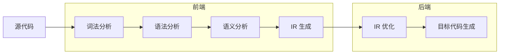

# Chapter 7: Translate to Intermediate Code

## 为什么需要中间表示 (IR)

直接将 AST 翻译成目标机器码的问题在于**耦合太紧**：

- 如果有 N 种源语言和 M 种目标机器，就需要 N x M 个编译器。
- 引入中间表示 (IR) 后，只需要 N 个前端（源语言 → IR）和 M 个后端（IR → 目标机器），共 N + M 个。

IR 的核心价值是**模块化**和**可移植性**。

---

## 什么是 IR

IR 是一种抽象机器语言：

- 用目标机器的操作来表达计算，但不绑定到特定机器细节。
- 独立于源语言的具体语法。
- 常见的 IR 形式包括：expression trees、Three-Address Code、Static Single Assignment (SSA) 等。
- 一个编译器可以使用**多级 IR**。

---

## 前端与后端



- **前端**：词法分析、语法分析、语义分析、翻译到 IR。
- **后端**：IR 优化、翻译到机器语言。

---

## 三地址码 (Three-Address Code)

### 基本形式

最基础的三地址码指令形如：

```text
x = y op z
```

- 每条指令最多有**一个操作符**在右侧。
- 地址可以是：源程序中的**名字**、**常量**（如 3）、或编译器生成的**临时变量**（如 t1）。

例如 `2*a + (b-3)` 被翻译为：

```text
t1 = 2 * a
t2 = b - 3
t3 = t1 + t2
```

三地址码没有标准形式，不同语言构造需要发明不同的指令形式。

### 实际例子

高级语言：

```text
read x
if 0 < x then
    fact := 1;
    repeat
        fact := fact * x;
        x := x - 1
    until x = 0;
    write fact
end
```

对应的三地址码：

```text
read x
t1 = x > 0
if_false t1 goto L1
fact = 1
label L2
t2 = fact * x
fact = t2
t3 = x - 1
x = t3
t4 = x == 0
if_false t4 goto L2
write fact
label L1
halt
```

### 实现方式：四元组 (Quadruples)

最常见的实现是将三地址码实现为**四元组**：一个操作字段 + 三个地址字段。对于不需要三个地址的指令，多余字段填 null。

```text
t1 = x > 0          →  (gt, x, 0, t1)
if_false t1 goto L1 →  (if_f, t1, L1, _)
fact = 1             →  (asn, 1, fact, _)
label L2             →  (lab, L2, _, _)
```

其他实现方式还有：triples、indirect triples。

---

## 中间表示树 (IR Trees)

### 设计目标

一个好的 IR 应该：

- 方便语义分析阶段产生。
- 方便翻译到各种真实机器语言。
- 每个构造有清晰简单的含义。
- IR 优化变换可以方便地指定和实现。

### 核心思想

IR 的每个组件只描述**极其简单的事情**：单次取数、存数、加法、移动或跳转。

翻译过程分两步：

1. 任意复杂的抽象语法 → 正确的 IR 指令集合。
2. IR 指令集合 → 真实机器指令。

### 表达式 (T_exp)

| 节点 | 含义 |
|------|------|
| `CONST(i)` | 整数常量 i |
| `NAME(n)` | 符号常量 n（汇编标签），即虚拟寄存器 |
| `TEMP(t)` | 临时变量 t |
| `BINOP(o, e1, e2)` | 对 e1、e2 施加二元操作 o（PLUS, MINUS, MUL, DIV, AND, OR, XOR, LSHIFT, RSHIFT, ARSHIFT） |
| `MEM(e)` | 从地址 e 开始的 wordSize 字节内存内容。作为 MOVE 的左孩子时表示"存"，其他位置表示"取" |
| `CALL(f, l)` | 函数调用：f 应用于参数列表 l，从左到右求值 |
| `ESEQ(s, e)` | 先执行语句 s（产生副作用），再求值 e 得到结果 |

### 语句 (T_stm)

语句执行副作用和控制流，**没有返回值**。

| 节点 | 含义 |
|------|------|
| `MOVE(TEMP t, e)` | 求值 e，结果移入临时变量 t |
| `MOVE(MEM(e1), e2)` | 求值 e1 得地址 a，求值 e2，存入从 a 开始的内存 |
| `EXP(e)` | 求值 e 并丢弃结果 |
| `JUMP(e, labs)` | 跳转到地址 e（可以是 NAME(label) 或计算出的地址）例如 `JUMP(MEM(BINOP(PLUS, table, index)), [L1, L2, L3])` |
| `CJUMP(o, e1, e2, t, f)` | 求值 e1、e2，用关系运算符 o 比较。true 跳 t，false 跳 f |
| `SEQ(s1, s2)` | 语句 s1 后接 s2 |
| `LABEL(n)` | 定义符号 n 的值为当前机器码地址（注意与 NAME 的区别：NAME 使用符号，LABEL 定义符号） |

---

## 从 AST 翻译到 IR 树

翻译方向：`A_xx`（抽象语法节点） → `T_xx`（IR 树节点）。

### 表达式的三种类型

AST 中的表达式在 IR 层面有三种情况：

| 类型 | 名称 | IR 表示 | 说明 |
|------|------|---------|------|
| `Ex` | Expression | `T_exp` | 有返回值的表达式 |
| `Nx` | No result | `T_stm` | 无返回值（如某些过程调用、while） |
| `Cx` | Conditional | `T_stm` + true/false 跳转列表 | 布尔值表达式，产生条件跳转 |

<div align=center>

</div>

核心数据结构：

```c
typedef struct Tr_exp_ *Tr_exp;
struct Cx { patchList trues; patchList falses; T_stm stm; };
struct Tr_exp_ {
    enum { Tr_ex, Tr_nx, Tr_cx } kind;
    union {
        T_exp ex;
        T_stm nx;
        struct Cx cx;
    } u;
};
```

`Tr_*` 是 Translate 模块的类型，`T_*` 是 Tree 模块的类型。

### Cx 与回填 (Backpatching)

对于条件表达式如 `a > b | c < d`，翻译时**不知道** true-destination 和 false-destination 具体是什么 label，因此先用 NULL 占位：

```c
Temp_label z = Temp_newlabel();
T_stm s1 = T_Seq(T_Cjump(T_gt, a, b, NULLt, z),
              T_Seq(T_Label(z),
                 T_Cjump(T_lt, c, d, NULLt, NULLf)));
```

使用 **patch list** 记录需要回填的位置：

```c
typedef struct patchList_ *patchList;
struct patchList_ { Temp_label *head; patchList tail; };
```

- **trues list**：记录所有需要回填 true-label 的位置。
- **falses list**：记录所有需要回填 false-label 的位置。

当 true/false label 确定后，调用 `doPatch` 一次性回填：

```c
void doPatch(patchList tList, Temp_label label) {
    for (; tList; tList = tList->tail)
        *(tList->head) = label;
}
```

### 三种类型的转换函数

有时需要将一种类型的表达式转换为另一种：

```c
static T_exp unEx(Tr_exp e);   // 任意 → Ex
static T_stm unNx(Tr_exp e);   // 任意 → Nx
static struct Cx unCx(Tr_exp e); // 任意 → Cx
```

!!! note "Tr_exp 三种转换"

    === "unEx"

        `unEx(e)`：把任意 `Tr_exp` 转换成一个有值的 `T_exp`。

        | 原形式 | 转换方式 |
        |---|---|
        | `Tr_ex` | 直接返回 `e->u.ex` |
        | `Tr_nx` | `ESEQ(e->u.nx, CONST 0)` |
        | `Tr_cx` | 生成一个临时变量 `r`，用控制流把真假转成 `1/0` |

        典型实现：

        ```c
        static T_exp unEx(Tr_exp e) {
            switch (e->kind) {
            case Tr_ex:
                return e->u.ex;

            case Tr_nx:
                return T_Eseq(e->u.nx, T_Const(0));

            case Tr_cx: {
                Temp_temp r = Temp_newtemp();
                Temp_label t = Temp_newlabel();
                Temp_label f = Temp_newlabel();

                doPatch(e->u.cx.trues, t);
                doPatch(e->u.cx.falses, f);

                return T_Eseq(
                    T_Seq(
                        T_Move(T_Temp(r), T_Const(1)),
                        T_Seq(
                            e->u.cx.stm,
                            T_Seq(
                                T_Label(f),
                                T_Seq(
                                    T_Move(T_Temp(r), T_Const(0)),
                                    T_Label(t)
                                )
                            )
                        )
                    ),
                    T_Temp(r)
                );
            }
            }

            assert(0);
        }
        ```

        对 `Tr_cx` 来说，逻辑相当于：

        ```text
        r = 1
        if condition goto t else goto f
        f:
          r = 0
        t:
          return r
        ```

    === "unNx"

        `unNx(e)`：把任意 `Tr_exp` 转换成一个无值语句 `T_stm`。

        | 原形式 | 转换方式 |
        |---|---|
        | `Tr_nx` | 直接返回 `e->u.nx` |
        | `Tr_ex` | `EXP(e->u.ex)`，执行表达式并丢弃结果 |
        | `Tr_cx` | 将真假出口 patch 到同一个 `done` 标签 |

    === "unCx"

        `unCx(e)`：把任意 `Tr_exp` 转换成条件形式 `Cx`。

        | 原形式 | 转换方式 |
        |---|---|
        | `Tr_cx` | 直接返回 `e->u.cx` |
        | `Tr_ex` | 生成 `CJUMP(NE, e->u.ex, CONST 0, ?, ?)` |
        | `Tr_nx` | 通常不合法，应该报错或断言失败 |


<div align=center>

</div>


### 合并条件表达式

- `a > b | c < d`：将 `a > b` 的 falses 列表填为 `c < d` 的 label。
- `a > b & c < d`：将 `a > b` 的 trues 列表填为 `c < d` 的 label。

---

## 简单变量的翻译

### 帧内变量

一个声明在当前函数栈帧中的变量 v 的地址：

```text
MEM(BINOP(PLUS, TEMP fp, CONST k))
```

- `k` 是 v 在帧内的偏移量。
- `TEMP fp` 是帧指针寄存器。

### Semant 与 Translate 的接口

Semant 模块不应直接引用 Tree 或 Frame 模块，所有 IR 树的操作都由 Translate 完成：

```c
Tr_Exp Tr_simpleVar(Tr_Access, Tr_Level);
```

Semant 传入变量的 access（由 `Tr_allocLocal` 获得）和使用该变量的函数 level。

### Frame 模块的机器相关定义

```c
/* frame.h */
Temp_temp F_FP(void);           // 帧指针寄存器
extern const int F_wordSize;     // 机器字大小
T_exp F_Exp(F_access acc, T_exp framePtr); // 将 access 转为 Tree 表达式
```

- `InFrame(k)`：返回 `MEM(BINOP(PLUS, TEMP FP, CONST(k)))`
- `InReg(t832)`：直接返回 `TEMP t832`

---

## 数组变量

不同语言对数组变量的处理不同：

- **Pascal**：数组变量代表数组**内容**。`a := b` 会拷贝整个数组。
- **C**：数组是"指针常量"。`a = b` 非法（不能给数组赋值），但 `b = a` 合法（b 指向数组开头）。
- **Tiger / Java / ML**：数组变量行为像**指针**。没有数组常量，新值通过 `ta[n] of i` 创建。赋值是指针赋值，不拷贝内容。

Tiger 中 record 也是指针，record 赋值同样是**指针赋值**。

---

## 结构化左值 (Structured L-Values)

### 左值与右值

- **左值 (L-value)**：可出现在赋值语句**左边**，表示一个可赋值的位置。如 `x`、`y.p`、`a[i+2]`。
- **右值 (R-value)**：只能出现在赋值语句**右边**，不表示可赋值位置。如 `a + 3`、`f(x)`。

### Tiger 的处理

Tiger 中所有变量和左值都是**标量**（scalar）。数组或 record 变量实际上是指针（一种标量）。

对于 C/Pascal 中的结构化左值（struct、数组、record），需要扩展 `T_Mem`：

```c
T_exp T_Mem(T_exp, int size);
```

`S` 表示要取/存的对象大小。

---

## 下标访问与字段选择

### 数组下标 a[i] 的地址

```text
(i - l) × s + a
```

- `a`：数组元素的基地址
- `l`：索引范围的下界
- `s`：每个元素的字节大小

如果 a 是全局的（编译时常量地址），`a - s × l` 可以在编译时计算。

### 左值应表示为地址

左值 a 应该翻译为**地址**（不含顶层 MEM 节点），而不是直接翻译为内存内容。这样后续可以：

- 赋值时：存到该地址（store）。
- 作为右值使用时：从该地址取值（fetch，加 MEM）。

### Tiger 中的数组下标

Tiger 中数组变量实际是指针，所以需要先通过 MEM 取出基地址：

```text
MEM(+(MEM(e), BINOP(MUL, i, CONST W)))
```

- `MEM(e)` 代表数组指针 a
- `W` 是字大小
- 整体表示 `a[i]` 的地址处的值

MEM 在 IR 中的双重含义：作为 MOVE 左孩子时表示 store，其他位置表示 fetch。

---

## 算术运算

- Tiger 中每个整数算术运算符直接对应 Tree 的 BINOP 运算符。
- **无一元运算符**：一元取反用 `0 - n` 实现；一元补码用 XOR 全 1 实现。
- **无浮点运算**（Tiger 语言）：浮点取反不能简单用 `0 - n`（因为负零的问题），Tree 语言不支持一元浮点取反。

---

## 条件表达式

### 比较运算符

比较运算符的翻译结果是 Cx 表达式：

```text
stm = CJUMP(LT, x, CONST(5), NULLt, NULLf)
trues = {t}
falses = {f}
```

### 组合条件

条件表达式可以用 Tiger 的 `&` 和 `|` 组合：

- `a > b | c < d`：将 `a > b` 的 falses 列表填为 `c < d` 的 label（false 时进入第二个条件）。
- `a > b & c < d`：将 `a > b` 的 trues 列表填为 `c < d` 的 label（true 时进入第二个条件）。

### if 表达式

`if e1 then e2 else e3` 的翻译：

```text
unCx(e1)
LABEL t
r = unEx(e2)
JUMP join
LABEL f
r = unEx(e3)
JUMP join
...
LABEL join
TEMP r
```

正确但不一定高效。优化：

- 如果 e2 和 e3 都是 Nx（无返回值），可以特殊处理。
- 如果 e2 或 e3 是 Cx，直接 `unEx` 会产生大量不必要的跳转和标签，应识别并特殊处理。

---

## While 循环

```text
test:
    if not(condition) goto done
    body
    goto test
done:
```

- `break` 语句翻译为 `JUMP done`。
- 为了知道 done label，`transExp` 需要一个额外参数 `break`，指向最近的外层循环的 done label。

---

## For 循环

朴素翻译：将 `for i := lo to hi do body` 重写为 let/while：

```text
let var i := lo
    var limit := hi
in while i <= limit
       do (body; i := i + 1)
end
```

**问题**：当 `limit = maxint` 时，`i + 1` 会溢出。

**修正方案**：

```text
if lo > hi goto done
i := lo
limit := hi
test:
    body
    if i >= limit goto done
    i := i + 1
    goto test
done:
```

---

## 函数调用

翻译函数调用 `f(a1, ..., an)` 很简单，只需添加**静态链接**作为隐式额外参数：

```text
CALL(NAME lf, [sl, e1, e2, ..., en])
```

- `lf`：函数 f 的 label
- `sl`：静态链接

---

## 声明的翻译

### 变量声明

`transDec` 更新值环境和类型环境：

- 变量初始化翻译为**赋值表达式**，这些表达式的树必须放在 let 的 body 之前。
- 函数和类型声明的结果是 `EXP(CONST(0))`（空操作）。

### 函数声明

一个函数被翻译为一个"汇编语言段"，包含三个部分：

```text
_global name

name:
    ...prologue...
    ...assembly code for body...
    ...epilogue...
```

**Prologue 包含**：

1. 标记函数开始的伪指令。
2. 函数名的 label 定义。
3. 调整栈指针的指令（分配新 frame）。
4. 将逃逸参数（包括静态链接）存入 frame，将非逃逸参数移入新的临时寄存器。
5. 保存 callee-save 寄存器（包括返回地址寄存器）的 store 指令。

**Body**：

6. 翻译后的表达式。

**Epilogue 包含**：

7. 将返回值移到返回值寄存器的指令。
8. 恢复 callee-save 寄存器的 load 指令。
9. 重置栈指针的指令（释放 frame）。
10. 返回指令（JUMP 到返回地址）。
11. 标记函数结束的伪指令。

---

## Fragment

Translate 阶段为每个函数产生一个 **fragment**，包含：

- **frame**：frame 描述符，包含关于局部变量和参数的机器特定信息。
- **body**：`procEntryExit1` 返回的结果。

Fragment 数据结构：

```c
typedef struct F_frag_ *F_frag;
struct F_frag_ {
    enum { F_stringFrag, F_procFrag } kind;
    union {
        struct { Temp_label label; string str; } stringg;
        struct { T_stm body; F_frame frame; } proc;
    } u;
};
```

两种 fragment 类型：

- **F_stringFrag**：字符串常量（label + 字符串内容）。
- **F_procFrag**：过程/函数（IR 语句体 + frame 描述符）。

Translate 模块的接口：

```c
void Tr_procEntryExit(Tr_level level, Tr_exp body, Tr_accessList formals);
F_fragList Tr_getResult(void);  // 返回所有函数 fragment 的列表
```

---

!!! summary
    1. **三地址码**是一种简单直观的 IR，每条指令最多一个操作符。
    2. **IR 树**是更结构化的表示，分为表达式 (T_exp) 和语句 (T_stm) 两类。
    3. 翻译时需要处理三种表达式类型：**Ex**（有值）、**Nx**（无值）、**Cx**（条件跳转），并通过 `unEx`/`unNx`/`unCx` 进行相互转换。
    4. **回填 (Backpatching)** 机制用于处理条件表达式合并时 label 的延迟绑定。
    5. 变量访问通过帧指针 + 偏移量实现；数组下标和字段选择通过地址计算实现。
    6. 函数调用需要添加静态链接；函数声明翻译为 prologue + body + epilogue 的 fragment。
