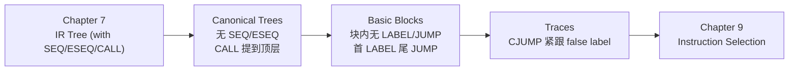

# Chapter 8: Basic Blocks and Traces

## 为什么需要这一章

chap7 把抽象语法翻译成了 IR 树（`T_exp` / `T_stm`），但直接拿这棵树去做指令选择会撞到几处和真实机器对不上的地方：

- **CJUMP 有两个 label**：`CJUMP(o, e1, e2, lt, lf)` 同时给出 true / false 两个目标；真实机器的条件跳转只跳其中一个分支，另一个 fall-through。
- **ESEQ 锁死了求值顺序**：`ESEQ(s, e)` 出现在表达式里以后，子树之间不能再自由换序，而公共子表达式、寄存器分配、指令调度这些优化都依赖"子表达式求值顺序可挑选"。
- **CALL 出现在表达式里**：所有函数共用一个返回值寄存器 `TEMP(RV)`。`BINOP(PLUS, CALL(f, …), CALL(g, …))` 里，第二个 CALL 会把第一个 CALL 留下的 RV 覆盖掉。
- **CALL 嵌在另一个 CALL 的实参里**：`CALL(f, [e1, CALL(g, [e2, …])])`，外层 CALL 往形参寄存器塞值的过程会被内层 CALL 直接破坏。

整体思路是把 IR 树分三段变换：



前一段处理 ESEQ / CALL，后两段处理 CJUMP。

---

## 三阶段变换的路线

| 阶段 | 输入 | 输出 | 解决的问题 |
|---|---|---|---|
| **Canonical Trees** | 任意 IR 树 | 一串 canonical tree 组成的线性列表 | ESEQ、CALL-in-expr、嵌套 CALL |
| **Basic Blocks** | 线性语句列表 | 一组基本块（块内顺序执行） | 为 trace 做准备 |
| **Traces** | 一组基本块 | 重排后的语句列表，`CJUMP` 紧跟 false label | CJUMP 双 label 与机器条件跳转的不对齐 |

走完三段，每条 `CJUMP(cond, lt, lf)` 后面就是 `LABEL(lf)`，可以直接翻译成"条件成立跳 lt，否则 fall-through 到 lf"。

---

## Canonical Trees：定义

> **Canonical Tree** 满足两条性质：
>
> 1. 树里没有 `SEQ` 或 `ESEQ` 节点；
> 2. 每个 `CALL` 节点的父亲，只能是 `EXP(...)` 或 `MOVE(TEMP t, ...)`。

性质 1 让整棵 canonical tree 最多只剩一个语句节点（根），其它都是不含 ESEQ 的表达式节点。再加性质 2，CALL 的孩子不可能再是 CALL，单棵 canonical tree 内也最多只能有一个 CALL（因为 `EXP(...)` 和 `MOVE(TEMP t, ...)` 各自只能放一个 CALL）。

所以函数体最终就是一串 canonical tree：每棵要么是不含 CALL 的简单语句，要么是以 CALL 收尾的 `EXP(CALL …)` / `MOVE(TEMP t, CALL …)`。

要做到这一步，得依次处理三件事：

1. **消除 ESEQ**：把 ESEQ 一路上提，直到能换成 SEQ；
2. **把 CALL 提到顶层**：CALL 之后立刻把返回值落进新临时变量；
3. **消除 SEQ**：把嵌套 SEQ 摊成线性列表。

---

## 消除 ESEQ

### 直接上提的规则

最简单的几种情形：ESEQ 出现在某个节点的**左孩子**位置时，可以直接把它提到该节点外面：

<div align=center>

</div>

```text
ESEQ(s1, ESEQ(s2, e))                ⇒  ESEQ(SEQ(s1, s2), e)
BINOP(op, ESEQ(s, e1), e2)           ⇒  ESEQ(s, BINOP(op, e1, e2))
MEM(ESEQ(s, e1))                     ⇒  ESEQ(s, MEM(e1))
JUMP(ESEQ(s, e1))                    ⇒  SEQ(s, JUMP(e1))
CJUMP(op, ESEQ(s, e1), e2, l1, l2)   ⇒  SEQ(s, CJUMP(op, e1, e2, l1, l2))
```

<div align=center>

</div>

只要 ESEQ 的语句 `s` 还排在所有需要的子表达式之前，把 `s` 拎到外层并不影响语义。

### 难点：ESEQ 在右孩子的位置

但 ESEQ 出现在 `BINOP` 或 `CJUMP` 的**右孩子**时：

```text
BINOP(op, e1, ESEQ(s, e2))
CJUMP(op, e1, ESEQ(s, e2), l1, l2)
```

照搬上面的规则得到 `ESEQ(s, BINOP(op, e1, e2))` 会改变求值顺序——原本 `e1` 在 `s` 之前求值，重写后 `s` 反而跑到 `e1` 前面。

反例：

<div align=center>

</div>

`s = MOVE(MEM(x), y)`、`e1 = MEM(x)`，重写前后 `e1` 读到的内存值不一样。

### 解决：引入新临时变量

通用做法是先把 `e1` 存进一个新临时寄存器 `t`，从而把"`e1` 早于 `s`"这件事固定下来：

<div align=center>

</div>

```text
BINOP(op, e1, ESEQ(s, e2))
    ⇒ ESEQ(MOVE(TEMP t, e1),
           ESEQ(s, BINOP(op, TEMP t, e2)))

CJUMP(op, e1, ESEQ(s, e2), l1, l2)
    ⇒ SEQ(MOVE(TEMP t, e1),
          SEQ(s, CJUMP(op, TEMP t, e2, l1, l2)))
```

ESEQ 消掉了，`e1` 先求值的顺序也保留下来。

### commute：保守的换序判断

如果 `e1` 本来就不依赖 `s` 的副作用——比如 `e1` 是常量、`s` 是空操作——就可以省掉那个新临时寄存器：

<div align=center>

</div>

```text
若 s, e1 可交换：
BINOP(op, e1, ESEQ(s, e2))            =  ESEQ(s, BINOP(op, e1, e2))
CJUMP(op, e1, ESEQ(s, e2), l1, l2)    =  SEQ(s, CJUMP(op, e1, e2, l1, l2))
```

两段代码是否可交换在一般情况下不可判定——光看 `s = MOVE(MEM(x), y)`、`e = MEM(z)`，编译期根本判断不出 `x` 和 `z` 是不是同一个地址。Tiger 编译器只做**保守近似**：

- 常量（`CONST`、`NAME`）与任何语句可交换；
- 空语句 `EXP(CONST X)` 与任何表达式可交换；
- 其余情况一律按"不可交换"处理。

实现也很短：

```c
static bool isNop(T_stm x) {
    return x->kind == T_EXP && x->u.EXP->kind == T_CONST;
}

static bool commute(T_stm x, T_exp y) {
    return isNop(x) || y->kind == T_NAME || y->kind == T_CONST;
}
```

### 通用重写算法

任何 Tree 节点的子表达式都可能是裸 `e`，也可能是 `ESEQ(s, e)`，因此消 ESEQ 的过程归结为两步：

1. **subexpression-extraction**：扫一遍节点的子表达式列表，把每个 ESEQ 拆出"前置语句 s"，子表达式本身换成 ESEQ-clean 版本；
2. **subexpression-insertion**：用清洁版的子表达式重建原节点，再把抽出来的所有 `s` 用 SEQ/ESEQ 拼到这个新节点前面。

子表达式列表 `[e1, e2, ESEQ(s, e3)]` 的三种处理方式：

| 情形 | 重写为 |
|---|---|
| `s` 与 `e1, e2` 都可交换 | `(s; [e1, e2, e3])` |
| `s` 与 `e2` 不可交换 | `(MOVE(t1, e1); MOVE(t2, e2); s); [TEMP t1, TEMP t2, e3]` |
| `s` 与 `e2` 可交换，但与 `e1` 不可 | `(MOVE(t1, e1); s); [TEMP t1, e2, e3]` |

Tiger 编译器把它封装成 `reorder` 函数。

### 完整重写规则表

整套 ESEQ 上提规则：

| 原形 | 重写为 |
|---|---|
| `ESEQ(s1, ESEQ(s2, e))` | `ESEQ(SEQ(s1, s2), e)` |
| `BINOP(op, ESEQ(s, e1), e2)` | `ESEQ(s, BINOP(op, e1, e2))` |
| `MEM(ESEQ(s, e1))` | `ESEQ(s, MEM(e1))` |
| `JUMP(ESEQ(s, e1))` | `SEQ(s, JUMP(e1))` |
| `CJUMP(op, ESEQ(s, e1), e2, l1, l2)` | `SEQ(s, CJUMP(op, e1, e2, l1, l2))` |
| `BINOP(op, e1, ESEQ(s, e2))` | `ESEQ(MOVE(TEMP t, e1), ESEQ(s, BINOP(op, TEMP t, e2)))` |
| `CJUMP(op, e1, ESEQ(s, e2), l1, l2)` | `SEQ(MOVE(TEMP t, e1), SEQ(s, CJUMP(op, TEMP t, e2, l1, l2)))` |
| `MOVE(ESEQ(s, e1), e2)` | `SEQ(s, MOVE(e1, e2))` |
| `CALL(f, a)` | `ESEQ(MOVE(TEMP t, CALL(f, a)), TEMP t)` |

最后一条把 CALL 提到顶层，正好是下一节。

---

## 把 CALL 提到顶层

Tree 语言允许 CALL 出现在任意表达式位置，但所有函数共用同一个返回值寄存器 `TEMP(RV)`。一旦表达式里出现两个 CALL：

```text
BINOP(PLUS, CALL(f, …), CALL(g, …))
```

第二个 `CALL(g, …)` 就会把第一个 CALL 留下的 RV 覆盖掉，`PLUS` 拿到的就是错的值。

办法是每个 CALL 一结束就立刻把 RV **拷到一个新的临时寄存器**，让后面用到这个返回值的地方都不再依赖 RV：

```text
CALL(f, args)   ⇒   ESEQ(MOVE(TEMP t, CALL(f, args)), TEMP t)
```

再叠加前面消 ESEQ 的过程，CALL 最后只会停在两种位置：

- `EXP(CALL …)`：调用结果被丢弃；
- `MOVE(TEMP t, CALL …)`：调用结果被存进临时变量 `t`。

这正是 canonical tree 的性质 2。

---

## 消 SEQ 与线性化

前两步做完以后，所有 ESEQ 都被消掉，CALL 都被提到顶层。函数体的 IR 长这样：

```text
SEQ(SEQ(SEQ(..., sx), sy), sz)
```

SEQ 全堆在树的上方。反复用结合律：

```text
SEQ(SEQ(a, b), c)  =  SEQ(a, SEQ(b, c))
```

整棵树就被拉成右倾形态：

```text
SEQ(s1, SEQ(s2, ..., SEQ(s_{n-1}, s_n)...))
```

此时 SEQ 只是把语句串起来，不再承担结构信息，直接看作**线性语句列表** `s1, s2, …, sn` 就行。每个 `si` 内部都不再含 SEQ 或 ESEQ。

Canon 模块的 `C_linearize` 负责这一步。

---

## Basic Blocks

### 动机

线性化只是把语句铺平，控制流分析还没开始。要分析跳转、寄存器活跃性、可达性，关心的对象其实是**控制流图（CFG）**——其中只有 `JUMP` / `CJUMP` 真正贡献信息，其他指令在控制流意义上都是"原地往下走一格"。

按单条指令建 CFG 太碎，更常见的做法是把连续没有跳转的指令合并成一个节点（basic block），再分析 block 之间的跳转。

### 定义

> **Basic Block** 是一段满足以下条件的语句序列：
>
> - 首条语句是 `LABEL(...)`；
> - 末条语句是 `JUMP(...)` 或 `CJUMP(...)`；
> - 中间不出现任何 `LABEL`、`JUMP` 或 `CJUMP`。

形态：

```text
LABEL Lk
   ... non-branch statements ...
JUMP / CJUMP
```

### 切分算法

线性列表 → basic blocks 一次扫描搞定：

1. 从头扫到尾；
2. 遇到 `LABEL`：结束上一个块，开启新块；
3. 遇到 `JUMP` / `CJUMP`：结束当前块，下一条语句开启新块；
4. 块尾如果不是 `JUMP` / `CJUMP`，在末尾**补一条 JUMP** 指向下一块的 label；
5. 开头不是 `LABEL` 的话，**伪造一个 label** 放在开头。

第 4、5 步是为了满足"首 LABEL、尾 JUMP/CJUMP"——补齐后每个 block 才能被它自己的 label 唯一标识，也能明确知道自己流向何处。

### 例子

一段三地址码：

```text
(1)  x := input
(2)  y := x - 1
(3)  z := x * y
(4)  if z < x goto (7)
(5)  p := x / y
(6)  q := p + y
(7)  a := q
(8)  b := x + a
(9)  c := a - b
(10) if p == q goto (12)
(11) goto (3)
(12) return
```

切分依据：

- LABEL 处开块：(3)、(7)、(12) 是跳转目标，需要在前一行结束块；
- JUMP/CJUMP 处闭块：(4)、(10)、(11)；
- 补齐：(1) 开头无 label，需要伪造；(4)→(5) 之间 fall-through，给 (5) 加 label。

切出来 6 个块（起始行号）：(1)、(3)、(5)、(7)、(11)、(12)。换成 Tree IR：

```text
... 块 (5-6) ...
LABEL(five)
MOVE(TEMP p, BINOP(DIV, TEMP x, TEMP y))
MOVE(TEMP q, BINOP(PLUS, TEMP p, TEMP y))
JUMP(NAME seven)                  -- 末尾补 JUMP 到下一块

LABEL(seven)
MOVE(TEMP a, TEMP q)
MOVE(TEMP b, BINOP(PLUS, TEMP x, TEMP a))
MOVE(TEMP c, BINOP(MINUS, TEMP a, TEMP b))
CJUMP(EQ, TEMP p, TEMP q, twelve, eleven)
...
```

至此每个 block 都满足"首 LABEL、尾 JUMP/CJUMP、内部干净"。Canon 模块的 `C_basicBlocks` 负责把线性列表打包成 `C_block`。

---

## Traces

### 动机：让 CJUMP fall-through

切分出 basic block 后，块的顺序是**任意**的——只要每个块仍按自己结尾的 JUMP/CJUMP 去后继，怎么排都能得到等价的程序。利用这点可以做两件事：

1. 让每个 `CJUMP(op, a, b, lt, lf)` 后面紧跟 `LABEL(lf)`，直接翻译成"条件成立跳 lt，否则 fall-through"；
2. 让无条件 `JUMP(NAME next)` 后面就是 `LABEL(next)`，从而把这条 JUMP 整个删掉。

第 2 点对热点代码很重要：少一条跳转就少一次流水线扰动。

### 把基本块组成控制流图

要排块，先把它们看成一张图。**每个 basic block 是一个节点**，块尾的跳转指令决定它的出边：

- `JUMP(NAME L)`：一条出边，指向以 `L` 开头的块；
- `CJUMP(cond, lt, lf)`：两条出边，分别指向 `lt` 块（true 后继）和 `lf` 块（false 后继）。

这张有向图就是**控制流图（CFG）**。trace scheduling 的本质，是给 CFG 的节点定一个一维顺序，让每个块的后继尽量挨着它出现——一旦相邻，块尾的跳转要么直接 fall-through（CJUMP 命中 false），要么可以删掉（JUMP 紧跟目标 label）。

### 定义

> **Trace** 是程序某次实际执行路径上可能被连续执行的一串基本块（可以包含 CJUMP 的某一个分支）。

要找一组 trace 覆盖整个程序，满足：

- **覆盖**：每个 block 恰好出现在一条 trace 中；
- **无环**：每条 trace 自身不构成循环；
- **数量尽量少**：trace 越少，trace 之间的 JUMP 就越少。

### DFS 取 trace 的算法（Algorithm 8.3）

<div align=center>

</div>

算法骨架就是**在 CFG 上做 DFS**，每次 DFS 走出来的一串块就是一条 trace：

```text
Q := 所有基本块
while Q 非空:
    T := 新建空 trace
    从 Q 头取一个未标记的 block b
    while b 未被标记:
        标记 b，把 b 追加到 T 的尾部
        从 b 的后继中挑一个未标记的 c
        b := c          -- 没有未标记后继则跳出内层
    输出 trace T
```

几个关键点：

- **每个块只被标记一次**，正好出现在一条 trace 里；
- **只在"还有未标记的后继"时才延伸**；后继全被别的 trace 吞掉时，当前 trace 就断；
- 外层 `while` 处理那些"漂在外面"的块——CFG 可能不连通，或者后继被先前的 trace 抢走，剩下的块要作为新 trace 的起点。

### An Example

考虑下面这张 CFG：B1 是 CJUMP 块，B2/B3 是两个分支，B4 是汇合点：

<div align=center>

</div>

DFS 从 B1 出发：

1. **trace 1 起步**：标记 B1。后继 {B2, B3} 都未标记，挑 false 后继 B3；
2. 走到 B3：标记，后继 {B4} 未标记，继续往前；
3. 走到 B4：标记，无未标记后继，trace 1 断。**trace 1 = [B1, B3, B4]**；
4. **trace 2 起步**：unmarked 只剩 B2。从 B2 走，后继 {B4} 已标记，立刻断。**trace 2 = [B2]**。

拼起来得最终块序：`B1, B3, B4, B2`。

- B1 的 `CJUMP(false → L3)` 后面紧跟 B3（label = L3） ✓
- B3 的 `JUMP L4` 后面紧跟 B4（label = L4） ✓
- B2 的 `JUMP L4` 落在序列末尾，目标 L4 不再相邻——这条 JUMP 在 finishing-up 阶段保留。

### CJUMP 双后继选哪一边

DFS 在 CJUMP 块往下走时，**两个后继都可能未标记**——选哪一个直接决定 finishing-up 的工作量：

- 选 **false 后继**最划算：CJUMP 自然就紧跟 false label，零调整；
- 选 **true 后继**也行，但 finishing-up 时要取反条件、交换标签；
- 两个后继**都已被别的 trace 吞掉**时，CJUMP 后面跟的会是个不相干的 label，finishing-up 时插一个伪块 `LABEL(lf'); JUMP(lf)` 来"接住" false 出口。

更聪明的实现会借 profile / loop 信息选边——把循环回边那一侧（多半是 hot path）安排成 fall-through。下面 Optimal Traces 讨论的 while 循环排布就是这种思路的具体体现。

### Finishing Up：扁平化与 CJUMP 调整

得到 trace 序列后还要把它串成一条长列表交给后端。CJUMP 此时分三种情况处理：

| 当前形态 | 调整方式 |
|---|---|
| `CJUMP(cond, a, b, lt, lf)` 紧跟 `LABEL(lf)` | 不动，这就是想要的形式 |
| `CJUMP(cond, a, b, lt, lf)` 紧跟 `LABEL(lt)` | **取反**条件，**交换** lt、lf；让 `LABEL(lt)` 当 false label |
| `CJUMP(cond, a, b, lt, lf)` 后既不是 lt 也不是 lf | 引入新 label `lf'`，重写为：`CJUMP(cond, a, b, lt, lf'); LABEL(lf'); JUMP(NAME lf)` |

处理完后每条 CJUMP 都紧跟 false label。这一步由 `C_traceSchedule` 完成。

### Optimal Traces：哪种顺序最好

不同 trace 划分会产生不同数量的 JUMP / CJUMP。下图比较一个 while 循环的三种排布：

<div align=center>

</div>

- **(a)** 单 trace 排成 `test → body → done`：每轮循环 `CJUMP` + `JUMP` 各一条；
- **(b)** 把 `done` / `body` 拆开放：每轮仍是 `CJUMP` + `JUMP`；
- **(c)** 把 prologue 的 `JUMP` 指向 test，trace 走 `body → test`：每轮只剩一条 `CJUMP`，仅进入循环的第一次多一条 `JUMP`。

(c) 把热路径放进同一条 trace，这就是 trace scheduling 的核心思路：

- 经常执行的指令序列（尤其是循环体）独占一条 trace；
- 后续的寄存器分配和指令调度也能拿到更连续的"直道"。

---

## Canon 模块接口

Canon 模块对外暴露三个函数，正好对应三阶段：

```c
typedef struct C_stmListList_ *C_stmListList;
struct C_block       { C_stmListList stmLists; Temp_label label; };
struct C_stmListList_{ T_stmList head; C_stmListList tail; };

T_stmList         C_linearize     (T_stm stm);
struct C_block    C_basicBlocks   (T_stmList stmList);
T_stmList         C_traceSchedule (struct C_block b);
```

- `C_linearize`：消 ESEQ + CALL 提顶层 + 摊平 SEQ，输出一条 canonical statement list；
- `C_basicBlocks`：把 statement list 切成 `C_block`；
- `C_traceSchedule`：DFS 排 trace，做 CJUMP 调整，输出最终语句列表。

---

## 附录：Canonical Tree 重写的 C 实现

下面是 Canon 模块里最核心的几段代码，方便对照前面的算法看实现。读完 `reorder` 的分工，整个消 ESEQ 流程就比较清楚了。

!!! note "Canon 模块源码摘录"

    === "接口与 reorder"

        ```c
        /* expRefList: 指向 T_exp 的指针组成的链表，便于在原地替换子表达式 */
        typedef struct expRefList_ *expRefList;
        struct expRefList_ { T_exp *head; expRefList tail; };

        /* stmExp: (语句, 表达式) 二元组 */
        struct stmExp { T_stm s; T_exp e; };

        /* 三个主函数 */
        static T_stm           reorder (expRefList rlist);
        static T_stm           do_stm  (T_stm stm);
        static struct stmExp   do_exp  (T_exp exp);
        ```

        - `reorder(rlist)`：输入一组子表达式指针，提取它们的"前置语句"并把每个子表达式替换为 ESEQ-clean 版本，返回那段前置语句。
        - `do_stm(stm)`：在 statement 层面消 ESEQ，是整个 canonicalization 的入口。
        - `do_exp(exp)`：把一个表达式 `e` 重写成 `ESEQ(s, e')` 中的 `(s, e')` 二元组；`e'` 不再包含 ESEQ。

        简单工具函数：

        ```c
        static bool isNop(T_stm x) {
            return x->kind == T_EXP && x->u.EXP->kind == T_CONST;
        }

        /* commute(s, e): 保守判断 s 是否能与 e 交换求值顺序 */
        static bool commute(T_stm x, T_exp y) {
            return isNop(x) || y->kind == T_NAME || y->kind == T_CONST;
        }
        ```

    === "do_stm"

        对各种 statement 做分支处理，把它们里面的 ESEQ 提到外层 SEQ：

        ```c
        /* processes stm so that it contains no ESEQ nodes */
        static T_stm do_stm(T_stm stm) {
            switch (stm->kind) {

            case T_SEQ:                       /* SEQ(s1, s2) */
                return seq(do_stm(stm->u.SEQ.left),
                           do_stm(stm->u.SEQ.right));

            case T_JUMP:                      /* JUMP(e) */
                return seq(reorder(ExpRefList(&stm->u.JUMP.exp, NULL)),
                           stm);

            case T_CJUMP:                     /* CJUMP(o, e1, e2, t, f) */
                return seq(reorder(ExpRefList(&stm->u.CJUMP.left,
                                  ExpRefList(&stm->u.CJUMP.right, NULL))),
                           stm);

            case T_MOVE:
                if (stm->u.MOVE.dst->kind == T_TEMP &&
                    stm->u.MOVE.src->kind == T_CALL)
                    /* MOVE(TEMP, CALL(...)) —— CALL 已经在顶层，重排实参 */
                    return seq(reorder(get_call_rlist(stm->u.MOVE.src)), stm);

                else if (stm->u.MOVE.dst->kind == T_TEMP)
                    /* MOVE(TEMP, e) —— 只对右值做 reorder */
                    return seq(reorder(ExpRefList(&stm->u.MOVE.src, NULL)),
                               stm);

                else if (stm->u.MOVE.dst->kind == T_MEM)
                    /* MOVE(MEM(e1), e2) —— 先 e1 后 e2 */
                    return seq(reorder(ExpRefList(&stm->u.MOVE.dst->u.MEM,
                                       ExpRefList(&stm->u.MOVE.src, NULL))),
                               stm);

                else if (stm->u.MOVE.dst->kind == T_ESEQ) {
                    /* MOVE(ESEQ(sx, e1), e2)  ⇒  SEQ(sx, MOVE(e1, e2)) */
                    T_stm s          = stm->u.MOVE.dst->u.ESEQ.stm;
                    stm->u.MOVE.dst  = stm->u.MOVE.dst->u.ESEQ.exp;
                    return do_stm(T_Seq(s, stm));
                }
                assert(0);

            case T_EXP:
                if (stm->u.EXP->kind == T_CALL)
                    return seq(reorder(get_call_rlist(stm->u.EXP)), stm);
                else
                    return seq(reorder(ExpRefList(&stm->u.EXP, NULL)), stm);

            default:
                return stm;
            }
        }
        ```

        要点：

        - 所有"子表达式可能含 ESEQ"的节点都走 `reorder` 提前置语句，再用 `seq(...)` 把它拼到原 stmt 前面；
        - `MOVE(ESEQ(...), e2)` 是唯一需要单独拆的情况，拆开后递归 `do_stm` 即可；
        - `MOVE/EXP` 里遇到 CALL 时调用 `get_call_rlist`，整体 reorder 参数列表，保证 CALL 落在合法的顶层位置。

    === "do_exp"

        把每种表达式拆成 `(前置语句, ESEQ-clean 表达式)`：

        ```c
        static struct stmExp do_exp(T_exp exp) {
            switch (exp->kind) {

            case T_BINOP:
                return StmExp(reorder(ExpRefList(&exp->u.BINOP.left,
                              ExpRefList(&exp->u.BINOP.right, NULL))),
                              exp);

            case T_MEM:
                return StmExp(reorder(ExpRefList(&exp->u.MEM, NULL)),
                              exp);

            case T_ESEQ: {
                /* ESEQ(stm, e) ⇒ 先消 e 得到 (x.s, x.e)
                   再把 do_stm(stm) 拼到 x.s 前面 */
                struct stmExp x = do_exp(exp->u.ESEQ.exp);
                return StmExp(seq(do_stm(exp->u.ESEQ.stm), x.s), x.e);
            }

            case T_CALL:
                /* CALL 提到顶层后，这里只是对参数做 reorder */
                return StmExp(reorder(get_call_rlist(exp)), exp);

            default:
                /* CONST / NAME / TEMP 等纯净节点 */
                return StmExp(reorder(NULL), exp);
            }
        }
        ```

        要点：

        - 分发只看节点种类，跨子表达式的换序问题全部丢给 `reorder`；
        - `T_ESEQ` 分支做"消 ESEQ"的递归：先递归处理内部表达式，再把当前 ESEQ 的语句段 `do_stm` 之后拼成前置语句；
        - 默认分支让叶子节点（`CONST`/`NAME`/`TEMP`）的前置语句是空操作（`reorder(NULL)` 返回 `EXP(CONST 0)`），跟其它分支返回类型对齐。

---

!!! summary
    1. IR 树到机器代码之间有四类错配：**CJUMP 双 label**、**ESEQ 锁求值顺序**、**CALL 在表达式中**、**嵌套 CALL 抢 RV**。
    2. 三段变换：**Canonical Trees → Basic Blocks → Traces**。前一段处理 ESEQ/CALL，后两段把 CJUMP 调成"紧跟 false label"。
    3. 消 ESEQ 就是不停地把它往上提；上提会破坏顺序时引入临时变量；`commute` 给一个保守的可换序判断，省掉一些临时变量。
    4. CALL 提到顶层后只剩 `EXP(CALL …)` 或 `MOVE(TEMP t, CALL …)` 两种位置。
    5. **Basic Block**：首 LABEL、尾 JUMP/CJUMP、中间无分支。切分时按 LABEL/JUMP 边界扫一遍，缺啥补啥。
    6. **Trace**：把基本块视作节点、跳转视作边连成控制流图（CFG），在 CFG 上跑 DFS，每条 DFS 路径就是一条 trace；扁平化后再对 CJUMP 做三种调整（直留 / 取反交换 / 引新 false label）。
    7. trace scheduling 的目标是让热路径独占一条 trace，减少 JUMP 数量并为后端的寄存器分配、指令调度铺路。
