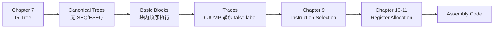

# Chapter 9: Instruction Selection

## 我们在哪

chap7 把 AST 翻译成了 IR 树，chap8 做了一系列 canonicalization 和重排：



Instruction Selection 的任务是把 IR 树翻译成**伪汇编代码**（abstract assembly），后续的寄存器分配再把伪寄存器替换成真实寄存器。

---

## 为什么需要指令选择

IR 树的每个节点只表达一个原始操作（fetch、store、add、CJUMP 等），但真实机器的一条指令往往可以同时完成多个操作。例如 `LOAD r1 <- M[r2 + c]` 同时做了地址计算（加法）和内存读取。

因此需要一个阶段来**把 IR 树映射到机器指令**——这就是指令选择（Instruction Selection）。核心思路是 **pattern matching**：每条机器指令对应 IR 树的一个 fragment（tree pattern），指令选择就变成了用 tree pattern 去**覆盖（tile）**整棵 IR 树。

---

## 树模式与覆盖

### Jouette 架构

为了说明算法，教材发明了一个教学用的 RISC 指令集——**Jouette**。其算术与访存指令如下：

<div align=center>

</div>

> **r0 恒为 0**，这是 Jouette 的重要约定。很多"从零加载常数"的操作会用到它。

每条指令的右侧给出了它对应的 tree pattern。注意：
- 指令集中既有产生寄存器结果的（双线上方），也有只产生副作用不返回结果的（双方下方，如 STORE、MOVEM）；
- 某些指令对应多个 pattern，这来自交换律（如 `+(e, CONST)` 和 `+(CONST, e)`）以及 r0 的特殊性（如 `LOAD r <- M[r0 + c]` 只需一个 CONST 节点）。

### 例子：`a[i] := x`

假设 `i` 是寄存器变量，`a` 和 `x` 是栈帧中的局部变量，那么 `a[i] := x` 对应的 IR 树为：

<div align=center>

</div>

这棵树可以有多种覆盖方式。以下是两种典型的 tiling：

<div align=center>

</div>

- **(a)** 用了 6 个 tile（含 STORE），生成 6 条指令（忽略 TEMP 节点对应的 0 条）；
- **(b)** 用了 5 个 tile + MOVEM，生成 5 条指令（如果 MOVEM 代价为 1）。

如果每个指令代价都是 1，那么 (a) 总代价为 6，(b) 总代价为 5。

### 最细粒度覆盖（tiny tiles）

即使没有任何"大 tile"可用，也**总可以用单节点 tile**覆盖整棵树：

<div align=center>

</div>

Jouette 的 LOAD/STORE/ADDI 都可以通过把常数设成 0 来退化成单节点模式，因此 tiny-tile baseline 总是存在的。代价是显然更高的（这张图用了约 10 条指令）。

---

## Optimal vs Optimum

| 概念 | 定义 | 说明 |
|---|---|---|
| **Optimum tiling** | 所有合法 tiling 中**总代价最小**的那一个 | 全局最优，可能不存在唯一解 |
| **Optimal tiling** | 不存在两个相邻 tile 能合并成一个**更低代价**的单一 tile | 局部最优，optimum 一定是 optimal，但反之不成立 |

假设所有指令代价为 1，只有 `MOVEM` 代价为 `m`：

<div align=center>

</div>

- 左图代价 = 6，右图代价 = 5 + m；
- 若 `m < 1`，右图是 optimum；若 `m > 1`，左图是 optimum；若 `m = 1`，两者都是 optimum；
- **但两图都是 optimal**——因为相邻 tile 之间没有可合并的更低代价组合。

> 实际编译器中，optimal tiling 往往已经足够好。对于现代 RISC（tile 小且代价均匀），optimal 和 optimum 通常没有区别。

---

## Maximal Munch

### 思路

**Maximal Munch** 是求 optimal tiling 的贪心算法：

1. **自顶向下**（top-down），从根节点开始；
2. 每次挑**最大**的 tile（节点数最多）去覆盖当前节点；
3. 覆盖后，对 tile 的每个 leaf 所连接的子树递归重复。

"最大"按节点数算：ADD 有 1 个节点，SUBI 有 2 个，STORE/MOVEM 有 3 个。

### 特点

- 生成的指令顺序与执行顺序**相反**：根节点先被匹配，但它的指令要依赖子树的结果，所以实际发出时子树指令在前；
- 若根处有两个同样大小的 tile 都能匹配，选择是**任意的**（可以任意打破平局）。

### 例子：`a[i] := x`

<div align=center>

</div>

从根节点 `MOVE` 出发：
1. 最大匹配是 `STORE`（3 节点）或 `MOVEM`（3 节点），两者一样大；假设选了 `STORE`；
2. 对 `STORE` 的两个 leaf 递归：
   - 左 leaf（地址子树）：最大匹配是 `LOAD`（3 节点：MEM(+(FP, CONST a))）；
   - 右 leaf（值子树）：最大匹配是 `LOAD`（3 节点：MEM(+(FP, CONST x))）；
3. `LOAD` 的地址子树继续展开……

### 实现：munchStm / munchExp

Maximal Munch 在 C 中的实现很直接：写两个递归函数 `munchStm`（处理 statement）和 `munchExp`（处理 expression），每个分支对应一个 tile pattern，按 tile 大小**从大到小**排列。

!!! note "Maximal Munch C 代码模板"

    === "munchStm（部分）"

        ```c
        static void munchStm(T_stm s) {
            switch(s->kind) {
            case T_MOVE: {
                T_exp dst = s->u.MOVE.dst, src = s->u.MOVE.src;
                if (dst->kind == T_MEM) {
                    /* MOVE(MEM(BINOP(PLUS, e1, CONST(i))), e2) */
                    if (dst->u.MEM->kind == T_BINOP
                        && dst->u.MEM->u.BINOP.op == T_plus
                        && dst->u.MEM->u.BINOP.right->kind == T_CONST) {
                        T_exp e1 = dst->u.MEM->u.BINOP.left, e2 = src;
                        munchExp(e1); munchExp(e2); emit("STORE");
                    }
                    /* MOVE(MEM(BINOP(PLUS, CONST(i), e1)), e2) */
                    else if (dst->u.MEM->kind == T_BINOP
                             && dst->u.MEM->u.BINOP.op == T_plus
                             && dst->u.MEM->u.BINOP.left->kind == T_CONST) {
                        T_exp e1 = dst->u.MEM->u.BINOP.right, e2 = src;
                        munchExp(e1); munchExp(e2); emit("STORE");
                    }
                    /* MOVE(MEM(e1), MEM(e2)) */
                    else if (src->kind == T_MEM) {
                        T_exp e1 = dst->u.MEM, e2 = src->u.MEM;
                        munchExp(e1); munchExp(e2); emit("MOVEM");
                    }
                    /* MOVE(MEM(e1), e2) */
                    else {
                        T_exp e1 = dst->u.MEM, e2 = src;
                        munchExp(e1); munchExp(e2); emit("STORE");
                    }
                }
                else if (dst->kind == T_TEMP) {
                    /* MOVE(TEMP(i), e2) */
                    T_exp e2 = src;
                    munchExp(e2); emit("ADD");
                }
                else assert(0);
                break;
            }
            case T_JUMP: ...
            case T_CJUMP: ...
            ...
            }
        }
        ```

    === "munchExp（概要）"

        ```text
        MEM(BINOP(PLUS, e1, CONST(i)))  =>  munchExp(e1); emit("LOAD");
        MEM(BINOP(PLUS, CONST(i), e1))  =>  munchExp(e1); emit("LOAD");
        MEM(CONST(i))                   =>  emit("LOAD");
        MEM(e1)                         =>  munchExp(e1); emit("LOAD");
        BINOP(PLUS, e1, CONST(i))       =>  munchExp(e1); emit("ADDI");
        BINOP(PLUS, CONST(i), e1)       =>  munchExp(e1); emit("ADDI");
        BINOP(PLUS, e1, e2)             =>  munchExp(e1); munchExp(e2); emit("ADD");
        TEMP(t)                         =>  {}  /* 无需指令 */
        ```

        每个箭头左侧是一个 tile pattern，右侧是对应的代码生成动作。

> 只要每种 Tree 节点类型至少存在一个单节点 tile，Maximal Munch 就**不会卡住**。

---

## Dynamic Programming

Maximal Munch 只求 optimal，不一定求 optimum。Dynamic Programming（DP）可以求出**最优覆盖**。

### 思路

DP 是**自底向上**（bottom-up）的：

1. 先递归计算每个子节点的最优代价；
2. 对当前节点 `n`，枚举所有能匹配 `n` 的 tile；
3. 对 tile `t`（代价 `c_t`），其 leaves 连接若干子树 `s_i`，这些子树的最优代价 `f(s_i)` 已经算好；
4. 该 tile 的总代价 = `c_t + Σ f(s_i)`；
5. 选总代价最小的 tile，记录 `f(n) = min(c_t + Σ f(s_i))`。

公式化：

$$
f(n) = \min_{\forall t \text{ matching } n} \left( c_t + \sum_{\forall \text{ leaf } i \text{ of } t} f(s_i) \right)
$$

### 例子：`MEM(+(CONST 1, CONST 2))`

<div align=center>

</div>

标注 `(cost, pattern#)` 表示该节点的最小代价和选用的 pattern 编号：

- `CONST 1`：只有 ADDI pattern 匹配，代价 1 → `(1, 8)`
- `CONST 2`：同理 → `(1, 8)`
- `+` 节点：多个 pattern 匹配
  - `ADD`：代价 1 + 1 + 1 = 3
  - `ADDI`（左 CONST）：代价 1 + 1 = 2
  - `ADDI`（右 CONST）：代价 1 + 1 = 2
  - **最小代价 = 2** → `(2, 6)` 或 `(2, 7)`
- `MEM` 节点：
  - `LOAD(MEM(e1))`：代价 1 + 2 = 3
  - `LOAD(MEM(+(e1, CONST)))`：代价 1 + 1 = 2
  - **最小代价 = 2** → `(2, 10)` 或 `(2, 11)`

### Emission 阶段

代价算完后，从根节点开始做 **Emission**：

```text
Emission(n):
    for each leaf li of the tile selected at n:
        Emission(li)
    emit the instruction matched at n
```

注意：Emission **不递归到 `n` 的所有 children**，而是只递归到**所选 tile 的 leaves**。上例中根 `MEM` 选了 `MEM(+(e1, CONST))` 这个 tile，所以 `+` 节点本身不是 leaf，不需要为它单独 emit 指令。最终输出：

```text
ADDI r1 <- r0 + 1
LOAD r1 <- M[r1 + 2]
```

### 复杂度

设：
- `T`：不同 tile 的总数
- `K`：平均每个 tile 的非叶子节点数
- `K'`：匹配一个节点最多需要检查的树节点数（≈ 最大 tile 大小）
- `T'`：平均每个树节点能匹配的 pattern 数
- `N`：IR 树的节点数

| 算法 | 时间复杂度 | 说明 |
|---|---|---|
| Maximal Munch | `O((K' + T') · N / K)` | 只需在 N/K 个节点上做匹配 |
| Dynamic Programming | `O((K' + T') · N)` | 每个节点都要匹配，且需要两遍遍历（cost + emission）|

对于典型 RISC（`T ≈ 50, K ≈ 2, K' ≈ 4, T' ≈ 5`），两者都是**线性时间**。实际测量表明，指令选择比编译器的其他阶段（甚至词法分析）都快得多。

---

## Tree Grammar（树文法）

对于更复杂的机器（多个寄存器类、多种寻址模式），DP 需要进一步推广。

### Schizo-Jouette：双寄存器类

假设一个"精神分裂版"Jouette，有两类寄存器：
- **a 寄存器**：专用于地址计算
- **d 寄存器**：专用于数据计算

<div align=center>

</div>

每个 tile 的根和 leaves 都要标上 `a` 或 `d`：
- `LOAD` 从 `a` 类寄存器做地址寻址，结果放入 `d` 类；
- `MOVEA` 把 `a` 的值传进 `d`；
- `MOVED` 把 `d` 的值传进 `a`。

### 用 CFG 描述 tile

这种约束可以用**上下文无关文法**表达。非终结符用 `s`（语句）、`a`（地址寄存器表达式）、`d`（数据寄存器表达式）：

```text
d → MEM(+(a, CONST))
d → MEM(+(CONST, a))
d → MEM(CONST)
d → MEM(a)
d → a
a → d
```

文法本身高度歧义：同一棵树有多种 parse（对应多种指令序列）。第 3 章的语法分析技术在这里不太适用，因为：
- 歧义是**固有的**——同一棵树确实可以由多条指令序列实现；
- 目标是找**最小代价的 parse**，而不是唯一的 parse。

### DP 的推广

DP 的推广很直接：每个节点不再只算一个最小代价，而是为**每个非终结符**各算一组最小代价。例如：
- `f_a(n)`：以 `n` 为根、匹配成 `a` 类寄存器的最小代价
- `f_d(n)`：以 `n` 为根、匹配成 `d` 类寄存器的最小代价

递推时，tile 的每个 leaf 根据其在文法中的非终结符类型，去取对应的代价。

### 代码生成器生成器

直接手写推广的 DP 算法在 C 中会很冗长。因此出现了若干工具：

- **Twig**（Aho et al., 1989）：基于 DP 的自动代码生成器；
- **BURG**（Fraser et al., 1992）：将 DP 从编译时移到编译器构造时，生成更快；
- 更早的 **Cattell**（1980）首次提出用 tree pattern 描述指令集并配合 Maximal Munch。

对于 RISC 机器，tile 小、非终结符少，这些工具可能有点"杀鸡用牛刀"。手工写 `munchStm`/`munchExp` 更常见。

---

## CISC 机器

现代 RISC 机器的七项典型特征：

1. 32 个寄存器；
2. 整数/指针寄存器只有一类；
3. 算术运算只能在寄存器之间做；
4. 三地址指令：`r1 ← r2 ⊕ r3`；
5. load/store 只有 `M[reg + const]` 一种寻址模式；
6. 每条指令定长 32 位；
7. 每条指令只产生一个结果或一个副作用。

CISC 机器（如 Intel x86）正好相反，有七项典型"问题"：

### 问题与对策

| # | CISC 问题 | 编译器对策 | 说明 |
|---|---|---|---|
| 1 | **寄存器少**（16/8/6 个）| 继续生成 TEMP，相信寄存器分配器 | 即使物理寄存器少，寄存器分配也能尽力复用 |
| 2 | **寄存器分类**（如 eax 专用于乘除）| 显式插入 move 指令 | Pentium 的 `mul` 要求左操作数在 eax，编译器先 `mov eax, t2` 再 `mul t3` |
| 3 | **二地址指令**（`r1 ← r1 ⊕ r2`）| 同样插入 move：`mov t1, t2; add t1, t3` | 若寄存器分配把 t1 和 t2 分配到同一寄存器，move 会被消除 |
| 4 | **算术指令可直接访问内存** | 两种方案等价：(a) 先 load 到寄存器再算；(b) 直接用 memory-mode 操作数 | 现代流水线里两者速度相同，但 (b) 更紧凑 |
| 5 | **多种寻址模式** | 直接用 tree-matching 选，或统一用简单 RISC-like 指令 | 复杂寻址往往并不比多条简单指令更快 |
| 6 | **变长指令** | 不影响编译器前端/中端，汇编器负责编码 | 对指令选择本身不是问题 |
| 7 | **副作用指令**（如 auto-increment）| (a) 忽略；(b) 特判匹配；(c) 改用 DAG-pattern 算法 | 现代 CISC（x86）已很少有副作用指令 |

> 这些对策高度依赖**寄存器分配器**：它负责消除多余的 move，也决定哪些 TEMP 应该 spill 到内存。因此 CISC 上的指令选择常和寄存器分配紧密交互。

---

## Tiger 编译器的指令选择

Tiger 编译器把指令选择拆成两步：先不管真实寄存器，只生成**抽象汇编指令**（`AS_instr`），然后再做寄存器分配。

### AS_instr 三种指令

```c
/* assem.h */
typedef struct {
    enum { I_OPER, I_LABEL, I_MOVE } kind;
    union {
        struct { string assem; Temp_tempList dst, src; AS_targets jumps; } OPER;
        struct { string assem; Temp_label label; } LABEL;
        struct { string assem; Temp_tempList dst, src; } MOVE;
    } u;
} *AS_instr;
```

| kind | 含义 | 关键字段 |
|---|---|---|
| `OPER` | 一般运算/访存/跳转指令 | `assem`（汇编模板）、`dst`（结果寄存器）、`src`（源寄存器）、`jumps`（跳转目标） |
| `LABEL` | 标号定义 | `assem`（标号字符串）、`label`（符号） |
| `MOVE` | 纯数据搬运 | `assem`、`dst`、`src`；若 dst 与 src 被分配到同一寄存器，可删除 |

`assem` 字符串中使用占位符：
- `'s0`, `'s1`, ...：源寄存器（由 `src` 列表提供）
- `'d0`, `'d1`, ...：目的寄存器（由 `dst` 列表提供）
- `'j0`, `'j1`, ...：跳转目标（由 `jumps` 提供）

### munchExp：表达式翻译

```c
static Temp_temp munchExp(T_exp e) {
    switch(e) {
    case MEM(BINOP(PLUS, e1, CONST(i))): {
        Temp_temp r = Temp_newtemp();
        emit(AS_Oper("LOAD 'd0 <- M['s0+" + i + "]\n",
                     L(r, NULL), L(munchExp(e1), NULL), NULL));
        return r; }
    case MEM(BINOP(PLUS, CONST(i), e1)): {
        Temp_temp r = Temp_newtemp();
        emit(AS_Oper("LOAD 'd0 <- M['s0+" + i + "]\n",
                     L(r, NULL), L(munchExp(e1), NULL), NULL));
        return r; }
    case MEM(CONST(i)): {
        Temp_temp r = Temp_newtemp();
        emit(AS_Oper("LOAD 'd0 <- M[r0+" + i + "]\n",
                     L(r, NULL), NULL, NULL));
        return r; }
    case MEM(e1): {
        Temp_temp r = Temp_newtemp();
        emit(AS_Oper("LOAD 'd0 <- M['s0+0]\n",
                     L(r, NULL), L(munchExp(e1), NULL), NULL));
        return r; }
    case BINOP(PLUS, e1, CONST(i)): {
        Temp_temp r = Temp_newtemp();
        emit(AS_Oper("ADDI 'd0 <- 's0+" + i + "\n",
                     L(r, NULL), L(munchExp(e1), NULL), NULL));
        return r; }
    case BINOP(PLUS, CONST(i), e1): { ... }
    case CONST(i): {
        Temp_temp r = Temp_newtemp();
        emit(AS_Oper("ADDI 'd0 <- r0+" + i + "\n",
                     L(r, NULL), NULL, NULL));
        return r; }
    case BINOP(PLUS, e1, e2): {
        Temp_temp r = Temp_newtemp();
        emit(AS_Oper("ADD 'd0 <- 's0+'s1\n",
                     L(r, NULL),
                     L(munchExp(e1), L(munchExp(e2), NULL)),
                     NULL));
        return r; }
    case TEMP(t):
        return t;
    ...
    }
}
```

### munchStm：语句翻译

```c
static void munchStm(T_stm s) {
    switch(s) {
    case MOVE(MEM(BINOP(PLUS, e1, CONST(i))), e2):
        emit(AS_Oper("STORE M['s0+" + i + "] <- 's1\n",
                     NULL,
                     L(munchExp(e1), L(munchExp(e2), NULL)),
                     NULL));
        break;
    case MOVE(MEM(BINOP(PLUS, CONST(i), e1)), e2):
        emit(AS_Oper("STORE M['s0+" + i + "] <- 's1\n",
                     NULL,
                     L(munchExp(e1), L(munchExp(e2), NULL)),
                     NULL));
        break;
    case MOVE(MEM(e1), MEM(e2)):
        emit(AS_Oper("MOVEM M['s0] <- M['s1]\n",
                     NULL,
                     L(munchExp(e1), L(munchExp(e2), NULL)),
                     NULL));
        break;
    case MOVE(MEM(e1), e2):
        emit(AS_Oper("STORE M['s0] <- 's1\n",
                     NULL,
                     L(munchExp(e1), L(munchExp(e2), NULL)),
                     NULL));
        break;
    case MOVE(TEMP(i), e2):
        emit(AS_Move("ADD 'd0 <- 's0 + r0\n",
                     i, munchExp(e2)));
        break;
    case LABEL(lab):
        emit(AS_Label(Temp_labelstring(lab) + ":\n", lab));
        break;
    ...
    }
}
```

### emit 与 codegen 入口

```c
static AS_instrList iList = NULL, last = NULL;

static void emit(AS_instr inst) {
    if (last != NULL)
        last = last->tail = AS_InstrList(inst, NULL);
    else
        last = iList = AS_InstrList(inst, NULL);
}

AS_instrList F_codegen(F_frame f, T_stmList stmList) {
    AS_instrList list;
    T_stmList sl;
    /* miscellaneous initializations */
    for (sl = stmList; sl; sl = sl->tail)
        munchStm(sl->head);
    list = iList; iList = last = NULL;
    return list;
}
```

### 过程调用

过程调用 `EXP(CALL(f, args))` 或函数调用 `MOVE(TEMP t, CALL(f, args))` 的匹配：

```c
case EXP(CALL(e, args)): {
    Temp_temp r = munchExp(e);
    Temp_tempList l = munchArgs(0, args);
    emit(AS_Oper("CALL 's0\n",
                 calldefs,           /* 被调用破坏的寄存器 */
                 L(r, l),            /* 被调用的函数地址 + 所有参数 */
                 NULL));
}
```

- `munchArgs(i, args)`：把第 i 个及之后的参数放到正确的位置（ outgoing 参数寄存器或栈），返回所有被传递的 temporaries 列表；
- `calldefs`：被 `CALL` 指令破坏的寄存器列表（caller-save、返回值寄存器、返回地址寄存器等）。这些要列为 `dst`，以便后续 liveness analysis 知道它们的值在这里被改写。

### 无帧指针的情况

有些机器不用专门的帧指针（FP），而是让"虚拟 FP"始终等于 `SP + frame_size`。这样省一条 copy 指令，也多出一个可用寄存器。

Translate 阶段生成的树仍然引用 FP，`codegen` 需要把 `FP + k` 替换成 `SP + k + fs`。但 `fs`（帧大小）在寄存器分配之前还不知道。解决方案是让 `codegen` 输出类似 `sp+L14_framesize` 的符号，由 `F_procEntryExit3` 生成的过程序言中定义这个汇编常量。

---

!!! summary
    1. 指令选择把 IR 树映射到机器指令，核心方法是**树模式匹配 / tiling**。
    2. **Jouette** 是教学用的 RISC 指令集；每条指令对应一个 tree pattern，覆盖 IR 树时 tile 之间不重叠。
    3. **Optimal tiling**（局部最优）≠ **optimum tiling**（全局最优）；对现代 RISC 两者通常一致。
    4. **Maximal Munch**：贪心、自顶向下、每次选最大 tile，实现为 `munchStm`/`munchExp` 递归函数。
    5. **Dynamic Programming**：自底向上，每个节点记录最小代价 `f(n) = min_t(c_t + Σf(leaf_i))`，然后 Emission 生成指令。复杂度 `O((K' + T')N)`，线性。
    6. **Tree Grammar**：对多寄存器类 ISA，用 CFG 描述 tile 约束，DP 推广为每个非终结符各算一组最小代价。
    7. **CISC 七问题**：寄存器少/分类/二地址/内存操作数/多寻址/变长/副作用，对策多依赖寄存器分配器（move 消除、spill 处理）。
    8. Tiger 编译器用 `AS_instr`（OPER/LABEL/MOVE）做抽象汇编，指令选择先生成含占位符的汇编模板，寄存器分配后再填真实寄存器名。
