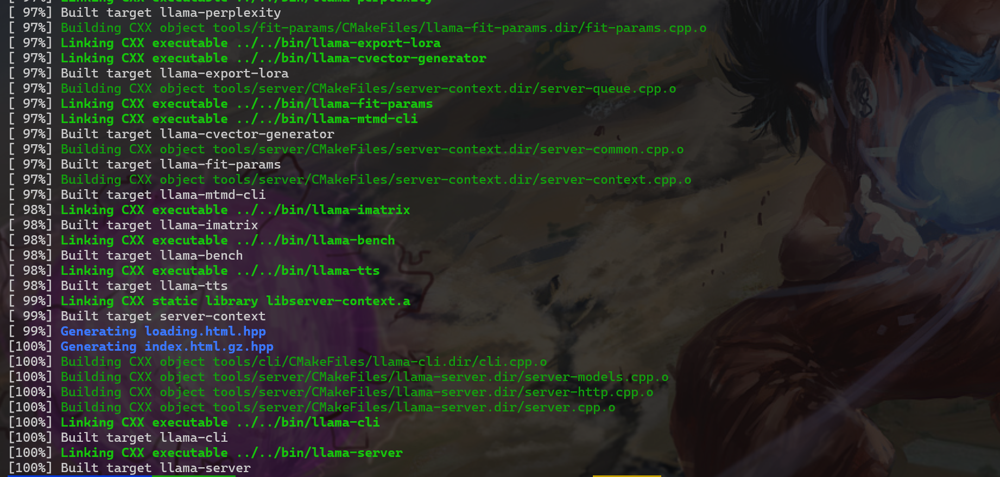
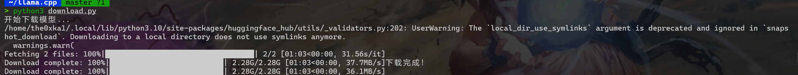
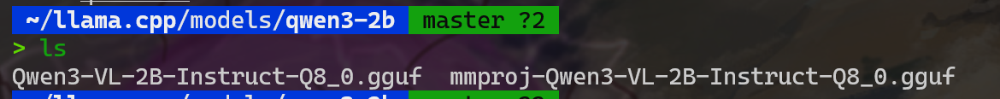

#### 环境准备

1. 克隆 [llama.cpp](https://github.com/ggml-org/llama.cpp.git)，并使用 `cmake` 构建项目,这里加上CUDA的配置比较好，

 ```bash
 git clone https://github.com/ggml-org/llama.cpp.git
 cd llama.cpp
 mkdir build
 cd build
 cmake .. -DGGML_CUDA=ON #这是开CUDA的意思，不开的话就只用cpu跑了，容易爆内存，而且慢
 cmake --build . --config Release -j 8 #8代表使用8个线程编译，可以根据你的服务器配置调整，这里直接复制跑就行
 ```

这一步比较耗时，正常的，成功之后长这样。


1. ggml-org/Qwen3-VL-2B-Instruct-GGUF · HF Mirror 模型文件，视觉模型一般分为两个文件，主模型和视觉组件。首先回到llama.cpp的根目录，然后下载模型文件：

```
mkdir models
pip install huggingface_hub
```

然后用这个python脚本下载模型：

```python
import os
# 用国内镜像，下载快些
os.environ["HF_ENDPOINT"] = "https://hf-mirror.com"

from huggingface_hub import snapshot_download

print("开始下载模型...")
snapshot_download(
    repo_id="ggml-org/Qwen3-VL-2B-Instruct-GGUF",
    allow_patterns="*.gguf",  # 只下载 gguf 文件
    local_dir="./models/qwen3-2b",
    local_dir_use_symlinks=False # 确保下载的是实实在在的文件
)
print("下载完成！")
```
把这个代码放在llama.cpp根目录下的download_model.py文件里，然后运行：

```bash
python download_model.py
```

下载完应该这样



可以检查一下你的`models/qwen3-2b/`目录下是否有两个`.gguf`文件。



到这我们的环境就配好了。

#### 运行

首先创建一个文件夹用来放图片：

```bash
mkdir images #把一张图片放进去，什么都行
```

然后在llama.cpp根目录下运行下面的命令：

```bash
./build/bin/llama-cli \
    -m ./models/qwen3-2b/Qwen3-VL-2B-Instruct-Q8_0.gguf \
    --mmproj ./models/qwen3-2b/mmproj-Qwen3-VL-2B-Instruct-Q8_0.gguf \
    -p "描述这张图片" \
    --image ./images/your_image.jpg \ 
    -n 512 -ngl 99
```