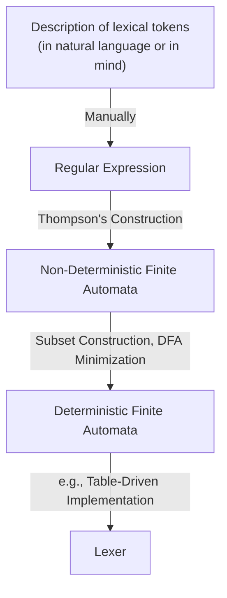

# LEXICAL ANALYSIS

!!!info "编译器概述"
    编译器的主要工作是将程序从一种语言翻译成另一种语言，通常分为前端和后端。
    
    * **前端 (Front End):** 负责程序的分析（Analysis）工作，理解程序的结构和含义。
    * **后端 (Back End):** 负责程序的综合与生成（Synthesis）工作。
    * **中间端 (Middle End):** 两者之间通过中间代码生成（IR Generation）分离，并进行与机器无关的代码优化。

分析阶段（Analysis）主要拆分为三个步骤：

1. 词法分析 (Lexical Analysis): 将输入的源程序分解为单个的单词或“Token”。
- 语法分析 (Syntax Analysis): 解析程序的短语结构。
- 语义分析 (Semantic Analysis): 计算和检查程序的具体含义。

---

## Lexical Analyzer

### 任务

词法分析器的输入是一串字符流，其主要任务是将其转化为词法标记（Token）流，例如变量名、关键字和标点符号等。在这个过程中，分析器会自动**丢弃空白字符（White space）和注释（Comments）**。词法分析的接口通常被设计成一个类似 `getToken` 的函数，每次被调用时返回下一个 Token。

### Lexical Tokens

!!!definition
    Token 是由一串字符组成的序列，它是编程语言语法中的基本单元。

* **常见分类:** 包括标识符（ID，如 `foo`）、数字（NUM，如 `73`）、浮点数（REAL，如 `66.1`）、关键字（如 `IF`、`RETURN`）以及各种符号（如 `COMMA`、`LPAREN` 等）。在大多数语言中，像 `IF` 这样的保留字不能用作标识符。

## Regular Expression

为了实现词法分析器，我们首先需要使用**正则表达式**来对编程语言的词法规则进行规范说明。在形式语言中，语言是字符串的集合，而正则表达式可以用有限的描述来指定这些可能是无限的字符串集合。

### 基本操作
> 或看The Missing Semester中的笔记[Regex](../CS/TMS/data-wrangling.md#正则表达式)

正则表达式由以下几种基本操作归纳定义：

1. **符号 (Symbol):** 例如 `a`，表示仅包含字符串 "a" 的语言。$L(a) = \{a\}$
2. **空串 (Epsilon, $\epsilon$):** 表示只包含空字符串 `""` 的语言。$L(\epsilon) = \{""\}$
3. **选择 (Alternation, `M|N`):** 字符串要么属于 `M` 的语言，要么属于 `N` 的语言。$L(M|N) = L(M) \cup L(N)$
4. **连接 (Concatenation, `M·N`):** 将属于 `M` 的字符串与属于 `N` 的字符串连接。$L(M·N) = \{xy | x \in L(M), y \in L(N)\}$
5. **闭包/重复 (Kleene closure, `M*`):** 零次或多次重复连接 `M` 中的字符串。$L(M*) = \{x_1x_2...x_n | n \geq 0, x_i \in L(M)\}$

### 简写形式

为了书写方便，正则表达式提供了一些不增加其描述能力，但更加易读的简写语法：

* `[abcd]` 等价于 `(a|b|c|d)`。
* `[b-g]` 等价于 `[bcdefg]`。
* `M?` 表示可选（零次或一次出现），等价于 `(M|$\epsilon$)`。
* `M+` 表示一次或多次重复，等价于 `(M·M*)`。
* `.`（句号）代表除换行符以外的任何单个字符。
* `"a.+"`,引号内的内容作为一个整体

!!!example
    

        
    

!!!info "消除歧义规则 (Disambiguation Rules)"
    在使用正则表达式生成词法分析器（如 Lex, JavaCC 等工具）时，存在两条重要的消除歧义规则：
    
    - **最长匹配原则 (Longest match):** 词法分析器总是提取能够匹配某个正则表达式的最长的初始子串作为下一个 Token。例如 `if8` 会被完整地作为一个标识符匹配，而不是拆分成保留字 `if` 和数字 `8`。
    
    - **规则优先级 (Rule priority):** 对于特定的最长子串，如果在定义中有多个正则表达式都能匹配，则采用最先写下的那条规则。这常用于区分关键字和普通标识符。例如`if`既可以匹配保留字`if`，也可以匹配标识符`if`，此时应该优先匹配保留字`if`。

---

## Finite Automata

虽然正则表达式方便人类进行定义，但要在计算机程序中实现词法分析器，需要借助于有限状态自动机。

### 基本定义

    
    <figcaption>Finite Automata for lexical analysis</figcaption>

有限状态自动机包含：

* 一个有限的状态集合（图中的圆圈）。
* 状态之间的边，且每条边都有来自输入字符集的符号标签。
* 一个起始状态(图中的1节点)。
* 若干个终止/接受状态（用双层圆圈表示）。

!!!info "DFA的合并"
    可以将以上多个DFA合并成一个，每个终止状态和对应的Type对应

    

        
    

### Deterministic Finite Automata (DFA)

在 DFA 中，**离开同一状态的任何两条边都不具有相同的符号标签**。

* **工作原理:** 从起始状态出发，对于输入字符串中的每个字符，自动机有且仅有一条匹配的边可走。如果处理完字符串后，自动机停在终止状态，则接受该字符串；如果不在终止状态，或者中途遇到没有合适标签的边可走，则拒绝。

* **代码实现:** DFA 通常可以用一个状态转移矩阵来实现（以状态编号和输入字符作为索引），并配合一个映射状态编号到对应 Token 类型动作的数组。为了追踪“最长匹配”，词法分析器会在运行中维护两个变量：最后遇到的终止状态（Last-Final）和对应的输入位置（Input-Position-at-Last-Final）。

    

词法分析器始终识别输入中最长可匹配的 Token。

词法分析器在遍历输入串时，会用两个变量来追踪“最长匹配”：

- `Last-Final`：最近一次进入的终止状态（final state）的编号，表明此时匹配到了一个 token（可能是若干种之一）。

- `Input-Position-at-Last-Final`：上一次进入终止状态时，输入流的位置（下标/指针），记录该 token 的末尾。

1. **初始化**：在词法分析器每次尝试识别一个 token 时，自动机状态设为起始状态，`Last-Final` 和 `Input-Position-at-Last-Final`都初始化为“无”。
- 扫描输入：每读入一个字符，跟着 DFA 进行状态转移。
    - 如果当前状态是终止状态，则更新：
        - `Last-Final = 当前状态编号`
        - `Input-Position-at-Last-Final = 当前输入位置`
- 失败检测（死状态）：
    - 如果没有合适的转移，进入系统的“死状态”（没有任何有效输出转换）。
    - 此时，停止本轮匹配。根据`Last-Final`信息，可以回溯确定：
        - 匹配成功的最长 token 类型（由`Last-Final`索引）。
        - Token 的终止位置（由`Input-Position-at-Last-Final`决定）。
    - 如果一次都没有遇到终止状态，则报错（非法输入）。

!!!example
    

        
    

    在状态3，输入了一个空格，此时进入死状态，此时根据`Last-Final`信息，可以回溯确定：需要`return IF`

    

        
    

    在状态12，输入了一个短`-`,同样识别出一个空格

    

        
    

    在状态10，输入了一个短`-`,进入死状态，此时根据`Last-Final`信息，可以回溯确定，是一个error

### Non-deterministic Finite Automata (NFA)

相较于 DFA，NFA 放宽了限制：

* 在给定同一个输入符号时，可能会有多条边跳转到多个不同的状态。
* 存在特殊的 $\epsilon$ 边（Epsilon-edges），自动机可以在不消耗任何输入符号的情况下顺着这些边进行状态转移。
* 接受条件: NFA 在遇到分支时需要“猜测”。只要存在任何一种正确的路径选择能够最终到达终止状态，NFA 就会接受该字符串。

!!!question "为什么需要 NFA？"
    既然 DFA 和 NFA 在计算能力上是等价的（都能且只能识别正则语言），为什么不直接使用 DFA？
    从正则表达式直接构建 DFA 比较复杂且不直观。而从正则表达式构建 NFA（如使用 Thompson 构造法）非常简单且机械化。NFA 充当了从“人类易读的规则（Regex）”到“机器高效执行的模型（DFA）”之间的中间表示。
    NFA 可以使用 $\epsilon$ 边和多条同标号边，这使得它在表示某些模式时比 DFA 更加紧凑，状态数量通常更少。

---

